<p align="center">
  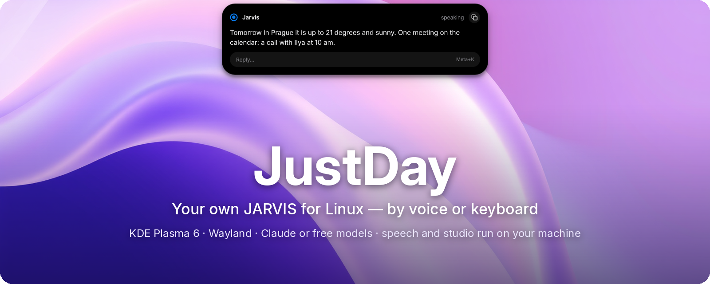
</p>

<p align="center">
  <a href="LICENSE"></a>
  
  
  
  <a href="https://github.com/0nigiris/JustDay/commits/main"></a>
  <a href="https://github.com/0nigiris/JustDay/actions/workflows/check.yml"></a>
</p>

<p align="center">
  <a href="#install">Install</a> ·
  <a href="#what-it-does">What it does</a> ·
  <a href="#how-it-looks">How it looks</a> ·
  <a href="#voice-or-keyboard">Keyboard</a> ·
  <a href="#music-and-video">Music & video</a> ·
  <a href="#studio">Studio</a> ·
  <a href="#models">Models</a> ·
  <a href="#privacy">Privacy</a> ·
  <a href="README.md">Русский</a>
</p>

**JustDay** is an AI assistant for Linux that **acts**, not just answers: it opens apps and sites, presses buttons in windows, installs software, writes messages and mail, draws pictures, edits video, plays games and hands coding to Claude Code. Talk to it or type — the answer shows up in a **Dynamic Island** at the top of the screen.

## Install

```bash
curl -fsSL https://raw.githubusercontent.com/0nigiris/JustDay/main/install.sh | bash
```

The installer shows one line per step, installs what is missing (asking for your password once, after showing what it is for) and then runs a short setup: language, name, model (it helps you sign in to Claude or pick a free one), **voice or text only**, the voice, the keys, mail and weather. Everything can be changed later in the island's settings.

| You need | For |
|---|---|
| KDE Plasma 6 on Wayland, PipeWire | the island, hotkeys, window control |
| A Claude subscription **or** a free model | the brain: Claude, Ollama's cloud, OpenRouter, DeepSeek, local Ollama |
| An NVIDIA GPU — *optional* | the neural voice, fast speech recognition, local models and the studio. Without one JustDay still works: by text, with a simple voice and a cloud model |

## What it does

<table>
<tr>
<td width="33%" valign="top">

**🖥️ Runs your computer**<br>
Apps, windows, mouse and keyboard. Buttons in Qt/GTK apps get numbered labels, so clicks land exactly. Simple commands run in a fraction of a second, without AI.

</td>
<td width="33%" valign="top">

**⌨️ Voice or text**<br>
<kbd>Meta</kbd>+<kbd>J</kbd> to talk, <kbd>Meta</kbd>+<kbd>K</kbd> to type. Text selected on screen is attached by itself: “translate”, “explain”. A text-only mode never opens the microphone.

</td>
<td width="33%" valign="top">

**🎨 A studio on your GPU**<br>
Pictures, photo edits, background removal, video from text or a photo, music, 3D models, voice-over, subtitles and montage. Free and offline.

</td>
</tr>
<tr>
<td valign="top">

**📦 Installs software**<br>
“Install OBS” — through [JII](https://github.com/0nigiris/JII): the most trusted source (Fedora, Flathub, COPR…), the password only in the system dialog.

</td>
<td valign="top">

**💬 Writes to people — after your “yes”**<br>
It shows the text on the island first and sends only after you confirm with a click, your voice or <kbd>Meta</kbd>+<kbd>Y</kbd>.

</td>
<td valign="top">

**✉️ Private mail and calendar**<br>
A local model reads and writes your mail — letters never go to the cloud. Google Calendar through its secret link.

</td>
</tr>
<tr>
<td valign="top">

**🧠 Learns**<br>
Remembers people (“Ilya — the one in Poland, message him on Discord”), habits and where your files are. Asks only when it doesn't know.

</td>
<td valign="top">

**🎮 Plays**<br>
Launches games from Steam, Heroic and other launchers — by the name you call them.

</td>
<td valign="top">

**👩‍💻 Manages Claude Code**<br>
Hands coding tasks to background Claude Code sessions, checks the result itself and reports.

</td>
</tr>
<tr>
<td valign="top">

**🗣️ A live voice**<br>
Qwen3-TTS on your GPU: “Jarvis”, a voice from a description or from a recording. It knows your voice and can ignore others.

</td>
<td valign="top">

**👂 Hears its name**<br>
“Jarvis, open Discord” — no key needed. Speech is recognised on your computer; false triggers are cut off by confidence.

</td>
<td valign="top">

**🎵 Its own player**<br>
“Play …” — the song plays in a couple of seconds right in the island: cover, equaliser, queue; the file downloads behind it. Videos play in the island, in a window or on YouTube — your call.

</td>
</tr>
<tr>
<td valign="top">

**📱 And from the phone**<br>
The same request, the same player, the same “I'm leaving” — from your phone, through the [phone half](phone/README.md): wake a machine that is off, watch its load, open a terminal.

</td>
<td valign="top">

**🌅 Morning briefing**<br>
The first “hello” of the day gets the day back: the weather, your next meeting, new mail and whatever was left from yesterday — in one sentence, without asking the model.

</td>
<td valign="top">

**⏱ Timers and alarms**<br>
“Set a timer for 10 minutes”, “wake me up at 7:30 every day”. The countdown is on the island, the alarm is a card with one button. Set instantly, without the model.

</td>
<td valign="top">

**🗣 A voice that doesn't stumble**<br>
Numbers, times and dates are said as words, English words go to the engine that can read them, and the speaking rate goes from 1.0 to 1.5. The voice is local; ElevenLabs if you like.

</td>
<td valign="top">

**🎭 Your own character**<br>
A butler, a friend, a calm helper, or one you describe in your own words. Swearing and “live speech” with pauses and slips are separate switches. Changes on the fly.

</td>
</tr>
<tr>
<td valign="top">

**⚡ Several things at once**<br>
“Update the system”, then “play some music” — the music plays right away. Long work goes to the background and shows on the island; a new request doesn't wait, a second session takes it.

</td>
<td valign="top">

**🎨 Colour from the music**<br>
The island takes the cover's colour — and when the cover says nothing, the colour of what the track is about: a yellow character's theme is yellow. A click on the cover shows it large.

</td>
<td valign="top">

**🧘 One-line install**<br>
The installer shows steps, not command output, installs what is missing itself and ends with one thing to do: press <kbd>Meta</kbd>+<kbd>J</kbd> and say hi.

</td>
</tr>
</table>

A detailed list with “verified / with a caveat” marks is in [CAPABILITIES.md](CAPABILITIES.md) (in Russian).

## How it looks

<table>
<tr>
<td width="50%" align="center">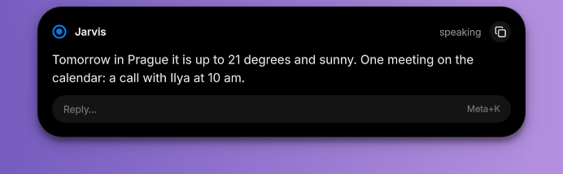<br><sub><b>An answer</b> — spoken and written; reply or copy right away</sub></td>
<td width="50%" align="center">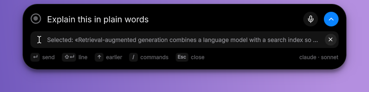<br><sub><b>Meta+K</b> — the text field, with the selected text already attached</sub></td>
</tr>
<tr>
<td align="center">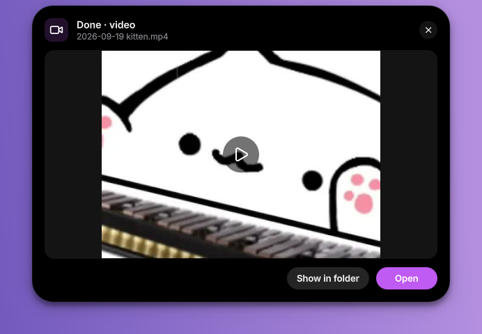<br><sub><b>Studio</b> — a finished video with a preview; long jobs run in the background</sub></td>
<td align="center">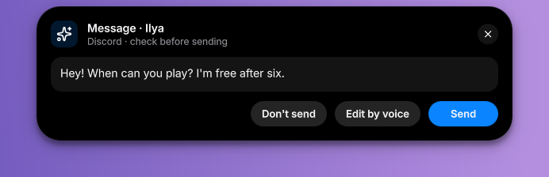<br><sub><b>A message</b> — nothing is sent without your “yes”</sub></td>
</tr>
<tr>
<td align="center">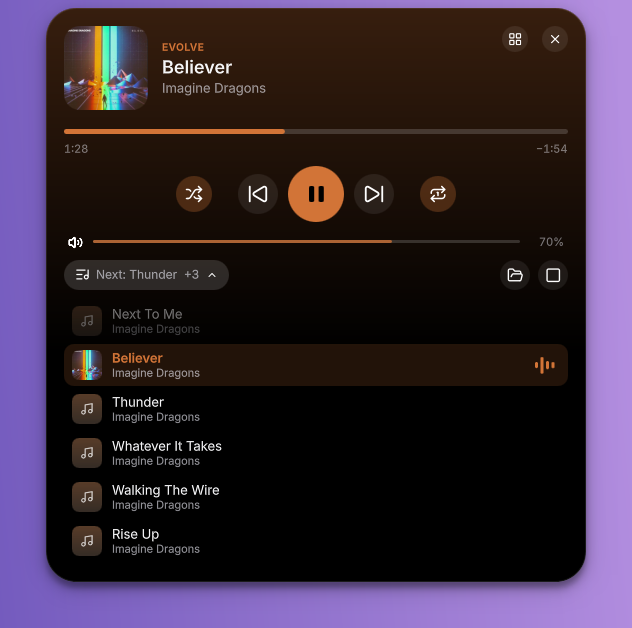<br>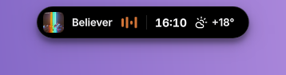<br><sub><b>Music</b> — albums and playlists, queue, shuffle and repeat; while it plays the island shows the cover and bars next to the time and weather</sub></td>
<td align="center">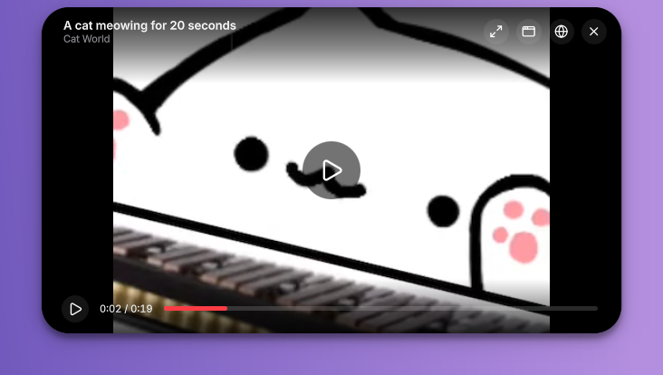<br><sub><b>Video right in the island</b> — or in a window, or on YouTube: Jarvis asks</sub></td>
</tr>
<tr>
<td align="center">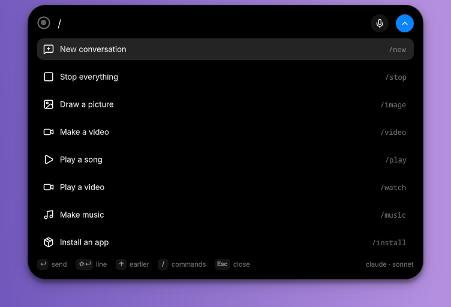<br><sub><b>/</b> — quick commands: new conversation, picture, video, microphone…</sub></td>
<td align="center">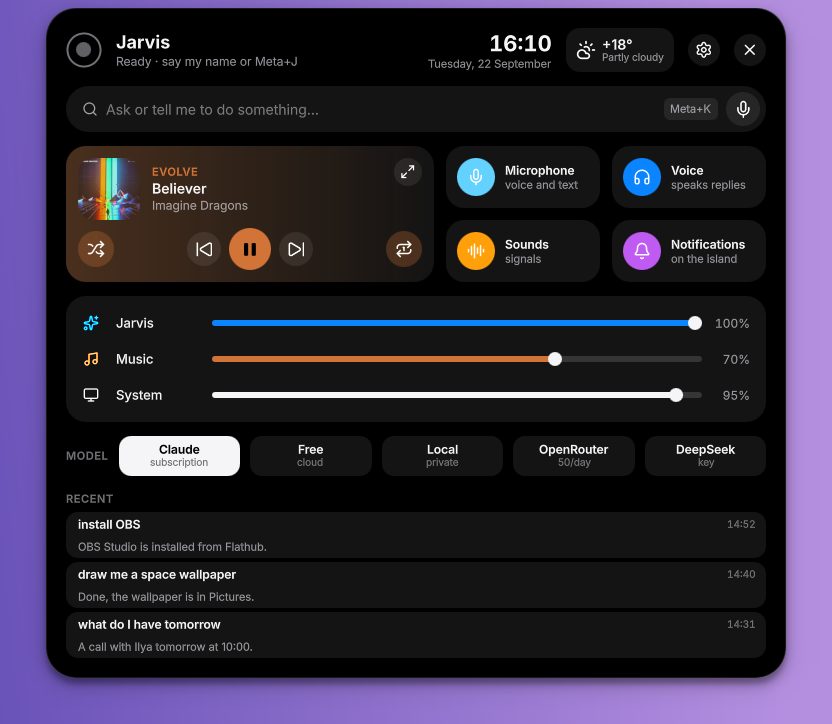<br><sub><b>The menu</b> — music, switches, three volumes (the assistant, the music, the system), the model, notifications and recent requests</sub></td>
</tr>
<tr>
<td align="center">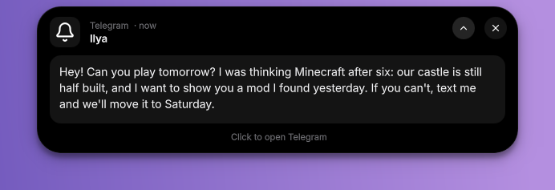<br><sub><b>Notifications</b> — ⌄ opens the whole message, ✕ dismisses it, a click opens the app — even from the tray</sub></td>
<td align="center">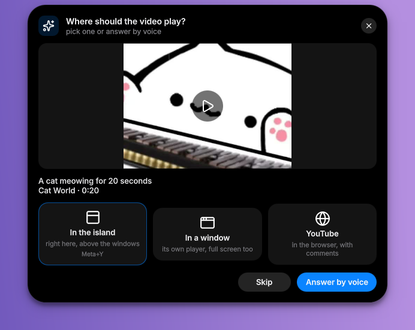<br><sub><b>Video</b> — it asks where to play it</sub></td>
</tr>
<tr>
<td align="center"><br>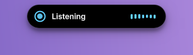<br><sub>What it is doing right now — in plain words</sub></td>
<td align="center">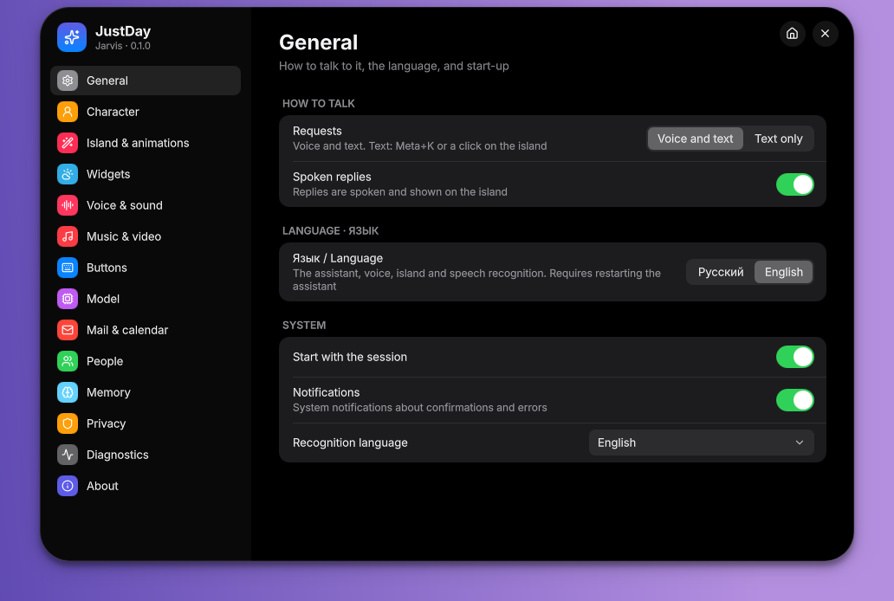<br><sub><b>Settings</b> right in the island: 14 sections</sub></td>
</tr>
<tr>
<td align="center">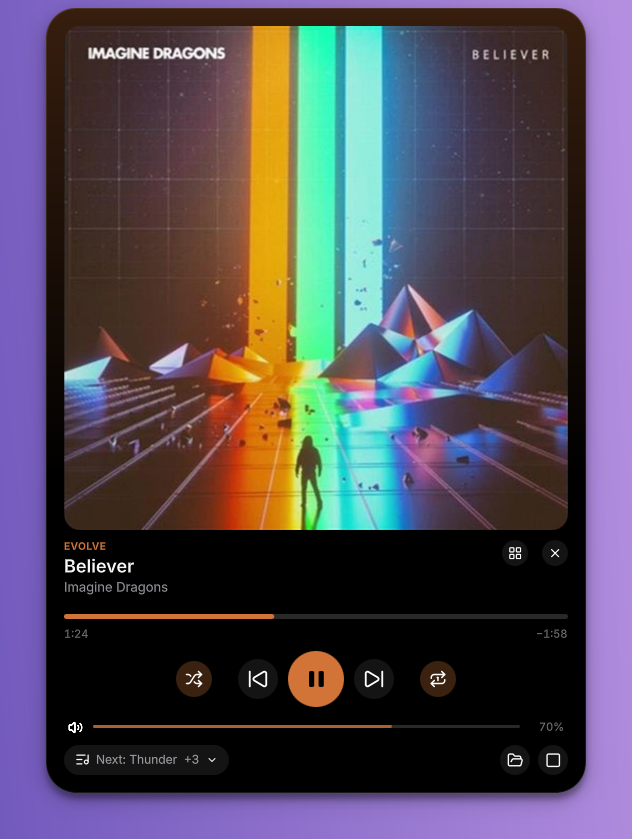<br><sub><b>The cover</b> — a click shows it large; the island's colour comes from the cover or from what the track is about</sub></td>
<td align="center">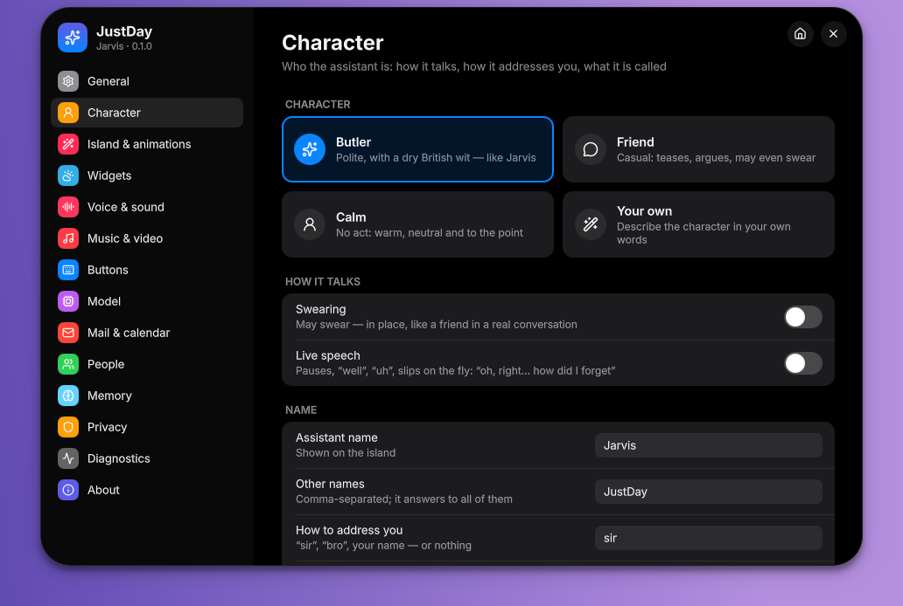<br><sub><b>Character</b> — butler, friend, calm or your own; swearing and live speech separately</sub></td>
</tr>
</table>

## Voice or keyboard

| Keys | What they do |
|---|---|
| <kbd>Meta</kbd>+<kbd>J</kbd> (or a mouse button) | talk: press — it listens until you pause; hold — while you hold. In text-only mode — the text field |
| <kbd>Meta</kbd>+<kbd>K</kbd> | type a request; the text selected on screen is attached |
| <kbd>Meta</kbd>+<kbd>Y</kbd> / <kbd>Meta</kbd>+<kbd>N</kbd> | “yes” / “no” to the island's question: allow an action, send a message |
| <kbd>Meta</kbd>+<kbd>Shift</kbd>+<kbd>J</kbd>, a double press, or “stop” | cancel everything |
| In the text field: <kbd>Enter</kbd> · <kbd>Shift</kbd>+<kbd>Enter</kbd> · <kbd>↑</kbd> · <kbd>/</kbd> · <kbd>Esc</kbd> | send · new line · earlier requests · commands · close |

**Without a microphone** (school, office, library): *Settings → General → Requests → “Text only”*. The microphone is never opened, speech recognition is not even loaded, and replies can be text only too (*“Spoken replies”*). All keys can be changed in *Settings → Buttons*.

## Music and video

“Jarvis, play Believer” — it plays in 3–5 seconds, without chatter. JustDay finds the song on YouTube (the original, not a cover or an hour-long loop), downloads the audio to `~/Music/JustDay/YouTube` and plays it in its own player. Next time the song plays from disk, even offline. Whole albums and playlists work (“play the album Meteora”), artists (“play Linkin Park”), shuffled or on repeat.

- While music plays, a **live pill** sits at the top: the cover, the title and the bars, and next to them the time, the weather and whatever runs in the background. A click opens the player with seeking, volume and the queue; a click on the cover shows it large.
- **The island's colour** is the cover's — and when the cover says nothing (black, grey), the model picks, once, the colour of what the track is about: a character's theme, a game's palette.
- “pause”, “next”, “back”, “shuffle”, “repeat”, “stop the music” work instantly, without AI. The player has the same buttons and the queue: a click on a song plays it. While Jarvis listens or speaks, the music gets quieter.
- The player is a separate service, so the music keeps playing even when the assistant restarts.

“Play a video about black holes” — Jarvis finds one and **asks where to show it**:

- **In the island** — the video loads (up to 720p) and plays right at the top of the screen, with the assistant's words as captions; a double click opens it full screen.
- **In a window** — a separate mpv player, starts at once.
- **YouTube** — the page in your browser, with comments.

To stop being asked, pick one in *Settings → Music & video*.

## Studio

Say or type: “draw a logo with a transparent background”, “bring this photo to life”, “make a 30-second lo-fi beat”, “turn this photo of a chair into a 3D model”, “cut the pauses out of this video and make it vertical for shorts”.

| What | How long on an RTX 3060 |
|---|---|
| A picture, a picture without background, ×4 upscale | 10–40 s |
| A photo edit from words | 1–2 min |
| Music and songs (with vocals) | ~15 s per 10 s of track |
| A 3D model from text or a photo → GLB + STL | ~3 min, in the background |
| Video from text or a photo | ~8 min per 3 s, in the background — JustDay tells you when it's ready |
| Voice-over in the assistant's voice, subtitles from speech | seconds |
| Montage: trim, join, music under video, burned-in subtitles, vertical 9:16, pause removal, speed-up, GIF, slideshow | seconds, ffmpeg |

Generation runs through a local [ComfyUI](https://github.com/comfyanonymous/ComfyUI) with FLUX.1-schnell, Qwen-Image-Edit, Wan 2.2, ACE-Step and Hunyuan3D. JustDay finds it by itself (`~/ai-local/ComfyUI`, `~/ComfyUI` or `[studio] comfy_dir`), runs it only on `127.0.0.1` and in a separate service with a memory limit. Check: `justday studio status`. Montage, subtitles and voice-over work without a GPU too.

## Models

| Provider | Price | What you need |
|---|---|---|
| **Claude** (default) | a Claude subscription | signed in to Claude Code — the setup helps |
| **Free** — Ollama's cloud | free, with limits | a free Ollama account |
| **OpenRouter** `openrouter/free` | free, ~50 requests a day | an OpenRouter key |
| **DeepSeek** | cheap | a DeepSeek key |
| **Local** Ollama | free, nothing leaves the machine | a GPU with 10 GB or more |
| Your own endpoint | — | any Anthropic-compatible API (LiteLLM, vLLM…) |

Memory, skills and the address book are shared by all models. Switch: island → menu → “Model”, or `justday model use <provider> <model>`.

## Privacy

| Stays on your computer | Goes to the cloud |
|---|---|
| microphone audio and speech recognition, the assistant's voice | the text of your requests and the replies — to the chosen model |
| mail, calendar, instant commands | selected text — only when it is attached to a request (you see it in the field) |
| pictures, video, music and 3D from the studio | the city name for the weather (Open-Meteo) |
| passwords and keys — in the system keyring, never in the assistant's memory | track titles, once each, when the island picks a colour from the music (can be turned off) |

Claude Code telemetry is off. Dangerous actions (deleting, `sudo`, force-push…) wait for your confirmation — also when they are started as background jobs; launching an app does not. More in the [manual](docs/MANUAL.md) (in Russian).

## Commands

```bash
justday ask "open discord"               # a request from the terminal
justday compose                          # open the text field on the island
justday play "Imagine Dragons Believer"  # a song from YouTube in its own player (count=5 — several)
justday video "black holes" where=island # video: island | window | browser (no where — it asks)
justday play "Linkin Park Meteora" playlist=1 shuffle=1   # an album, shuffled
justday player repeat one                # pause | next | prev | repeat off|all|one | shuffle on|off | seek 60 | volume 50 | color yellow
justday job start "System update" -- jii update --json   # something long, in the background
justday persona friend swearing=on live=on               # the character: jarvis | friend | calm | custom
justday studio image "a red fox, watercolor" size=wide
justday studio vertical ~/Videos/clip.mp4
justday setup                            # the setup again
justday doctor                           # check everything
justday update                           # update (the island tells you when there is something new)
justday logs -f                          # what it hears and does
```

<details>
<summary><b>Questions</b></summary>

**Does it work without an NVIDIA GPU?** Yes. The setup picks speech recognition on the CPU (or text-only mode), the simple Silero voice and a cloud model. Only the neural voice, local models and studio generation are not available.

**Can I use it without voice at all?** Yes: *Settings → General → “Text only”* and turn off *“Spoken replies”*. <kbd>Meta</kbd>+<kbd>K</kbd> opens the text field.

**Will it send or delete something on its own?** Messages and mail only after your “yes”. Deleting files, `sudo`, removing software and other dangerous actions need a confirmation too.

**Other desktops (GNOME, X11)?** Only KDE Plasma 6 on Wayland for now: the island, hotkeys and window control rely on KWin.

**Where do studio files go?** `~/Pictures/JustDay`, `~/Videos/JustDay`, `~/Music/JustDay` and `~/Documents/JustDay/3D`; the island has “Open” and “Show in folder” buttons.

**Does it speak English?** Yes — the island, the settings, the voice and the replies. *Settings → General → Language*.

</details>

📖 **[The full manual](docs/MANUAL.md)** (in Russian) — how it works, models, voice, memory, mail, games, studio, safety, troubleshooting.

## Contributing

Bugs and ideas — in [Issues](https://github.com/0nigiris/JustDay/issues). Code, comments and commit history are in English; the interface is in Russian and English (`island/i18n`, `src/justday/i18n.py`). The README screenshots are taken in an isolated KWin session with default settings, in both languages: `SHOTS_LANG=ru|en tests/ui/readme_shots.sh`.

## License

JustDay © 2026 [0nigiris](https://github.com/0nigiris) — **GNU GPL v3 or later** ([LICENSE](LICENSE)): you may change and share the code, keeping the authorship and keeping derived versions open under the GPL.

Third-party parts: [Lucide](https://lucide.dev) icons (ISC); the built-in voices were made with Qwen3-TTS (Apache 2.0); the interface is inspired by the Dynamic Island, the ChatGPT companion window and Raycast's Quick AI.
