<p align="center">
  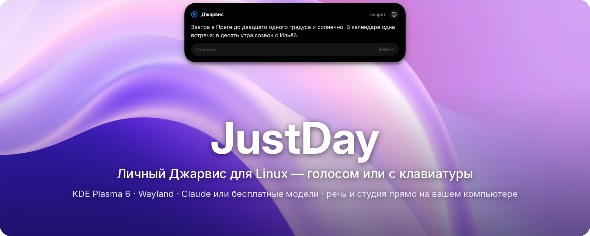
</p>

<p align="center">
  <a href="LICENSE"></a>
  
  
  
  <a href="https://github.com/0nigiris/JustDay/commits/main"></a>
</p>

<p align="center">
  <a href="#установка">Установка</a> ·
  <a href="#что-умеет">Что умеет</a> ·
  <a href="#как-выглядит">Как выглядит</a> ·
  <a href="#голосом-или-с-клавиатуры">Клавиатура</a> ·
  <a href="#музыка-и-видео">Музыка и видео</a> ·
  <a href="#студия">Студия</a> ·
  <a href="#модели">Модели</a> ·
  <a href="#приватность">Приватность</a> ·
  <a href="docs/MANUAL.md">Руководство</a> ·
  <a href="#english">English</a>
</p>

**JustDay** — ИИ-ассистент для Linux, который не просто отвечает, а **делает**: открывает программы и сайты, нажимает кнопки в окнах, ставит программы, пишет сообщения и письма, рисует картинки, монтирует видео, играет в игры и раздаёт задачи Claude Code. Говорите с ним голосом или пишите с клавиатуры — ответ появится в **Dynamic Island** сверху экрана.

## Установка

```bash
curl -fsSL https://raw.githubusercontent.com/0nigiris/JustDay/main/install.sh | bash
```

Установщик сам поставит зависимости и запустит мастер настройки: язык, имя, модель (поможет войти в Claude или выбрать бесплатную), **голосом или только текстом**, голос, кнопки, почта и погода. Всё потом меняется в настройках острова.

| Нужно | Зачем |
|---|---|
| KDE Plasma 6 на Wayland, PipeWire | остров, горячие клавиши, управление окнами |
| Подписка Claude **или** бесплатная модель | «мозг»: Claude, облако Ollama, OpenRouter, DeepSeek, локальная Ollama |
| Видеокарта NVIDIA — *по желанию* | живой голос, быстрое распознавание, локальные модели и студия. Без неё JustDay работает: текстом, простым голосом и с облачной моделью |

## Что умеет

<table>
<tr>
<td width="33%" valign="top">

**🖥️ Управляет компьютером**<br>
Приложения, окна, мышь и клавиатура. Кнопки Qt/GTK-программ размечаются номерами — клики точные. Простые команды выполняются без ИИ за доли секунды.

</td>
<td width="33%" valign="top">

**⌨️ Голосом или текстом**<br>
<kbd>Meta</kbd>+<kbd>J</kbd> — говорить, <kbd>Meta</kbd>+<kbd>K</kbd> — написать. Выделенный на экране текст прикрепляется сам: «переведи», «объясни». Режим «только текст» — без микрофона.

</td>
<td width="33%" valign="top">

**🎨 Студия на вашей видеокарте**<br>
Картинки, правка фото, удаление фона, видео из текста и оживление фото, музыка, 3D-модели, озвучка, субтитры и монтаж. Бесплатно и без облака.

</td>
</tr>
<tr>
<td valign="top">

**📦 Ставит программы**<br>
«Установи OBS» — через [JII](https://github.com/0nigiris/JII): лучший доверенный источник (Fedora, Flathub, COPR…), пароль только в системном окне.

</td>
<td valign="top">

**💬 Пишет людям — после вашего «да»**<br>
Сначала показывает текст на острове, отправляет только после подтверждения кнопкой, голосом или <kbd>Meta</kbd>+<kbd>Y</kbd>.

</td>
<td valign="top">

**✉️ Почта и календарь приватно**<br>
Письма читает и пишет локальная модель — в облако они не уходят. Календарь Google — по секретной ссылке.

</td>
</tr>
<tr>
<td valign="top">

**🧠 Учится**<br>
Помнит людей («Илья — тот, что в Польше, писать в Discord»), привычки и где лежат файлы. Спрашивает, только когда не знает.

</td>
<td valign="top">

**🎮 Играет**<br>
Запускает игры из Steam и лаунчеров. В Minecraft — через свой мод-мост с Baritone: добыть дерево, скрафтить инструменты.

</td>
<td valign="top">

**👩‍💻 Руководит Claude Code**<br>
Отдаёт задачи по коду фоновым сессиям Claude Code, сам проверяет результат и докладывает.

</td>
</tr>
<tr>
<td valign="top">

**🗣️ Живой голос**<br>
Qwen3-TTS на вашей видеокарте: «Джарвис», «Пятница», голос по описанию или из записи. Узнаёт ваш голос и может игнорировать чужие.

</td>
<td valign="top">

**👂 Слышит по имени**<br>
«Джарвис, открой Дискорд» — без кнопки. Распознавание речи идёт на компьютере; ложные срабатывания отсекаются по уверенности.

</td>
<td valign="top">

**🎵 Свой плеер**<br>
«Включи песню…» — скачает с YouTube и сыграет прямо в острове: обложка, эквалайзер, очередь. Видео — в острове, в окне или на YouTube, как скажете.

</td>
</tr>
</table>

Подробный список с пометками «проверено / с оговоркой» — в [CAPABILITIES.md](CAPABILITIES.md).

## Как выглядит

<table>
<tr>
<td width="50%" align="center">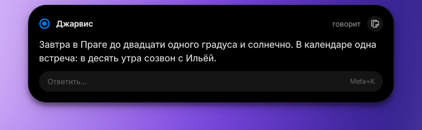<br><sub><b>Ответ</b> — голосом и текстом, можно сразу ответить или скопировать</sub></td>
<td width="50%" align="center">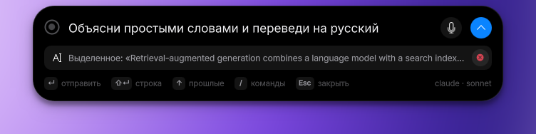<br><sub><b>Meta+K</b> — поле ввода, выделенный текст уже прикреплён</sub></td>
</tr>
<tr>
<td align="center">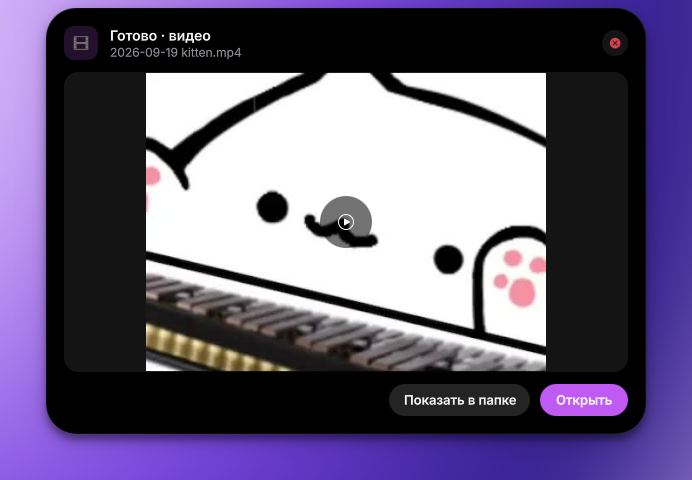<br><sub><b>Студия</b> — готовое видео с превью; долгие задачи идут в фоне</sub></td>
<td align="center">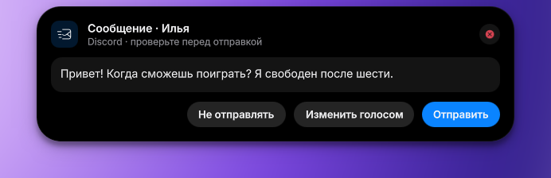<br><sub><b>Сообщение</b> — ничего не уходит без вашего «да»</sub></td>
</tr>
<tr>
<td align="center">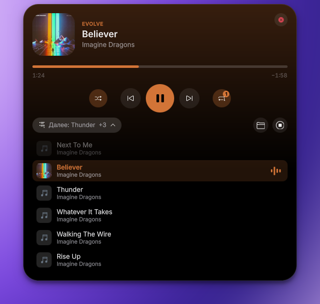<br>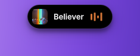<br><sub><b>Музыка</b> — альбомы и плейлисты, очередь, перемешивание и повтор; пока играет, сверху обложка и эквалайзер</sub></td>
<td align="center">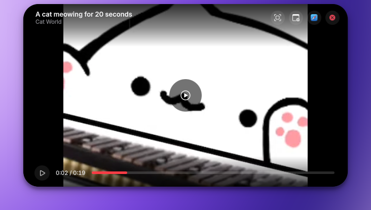<br><sub><b>Видео прямо в острове</b> — или в окне, или на YouTube: Джарвис спросит</sub></td>
</tr>
<tr>
<td align="center">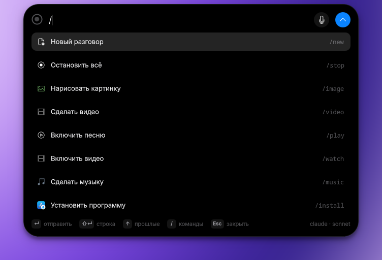<br><sub><b>/</b> — быстрые команды: новый разговор, картинка, видео, микрофон…</sub></td>
<td align="center">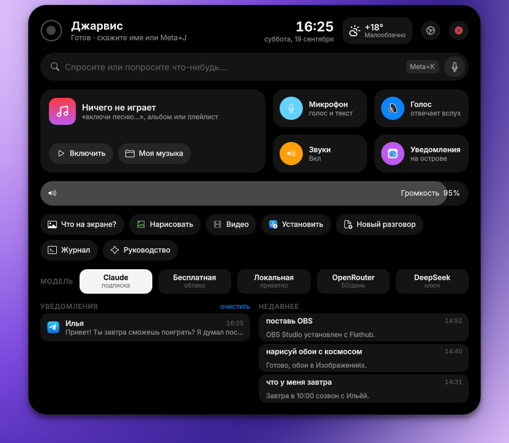<br><sub><b>Меню</b> — музыка, переключатели, громкость, быстрые действия, модель, уведомления и недавнее</sub></td>
</tr>
<tr>
<td align="center">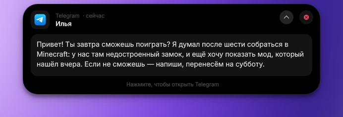<br><sub><b>Уведомления</b> — ⌄ раскрывает всё сообщение, ✕ убирает, клик открывает приложение</sub></td>
<td align="center">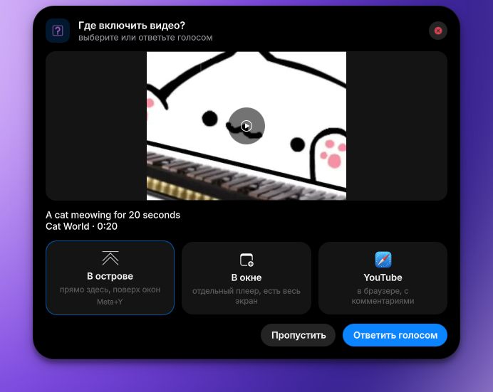<br><sub><b>Видео</b> — сам спросит, где показать</sub></td>
</tr>
<tr>
<td align="center"><br>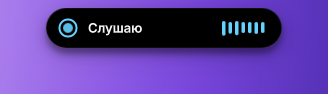<br><sub>Что делает прямо сейчас — человеческими словами</sub></td>
<td align="center">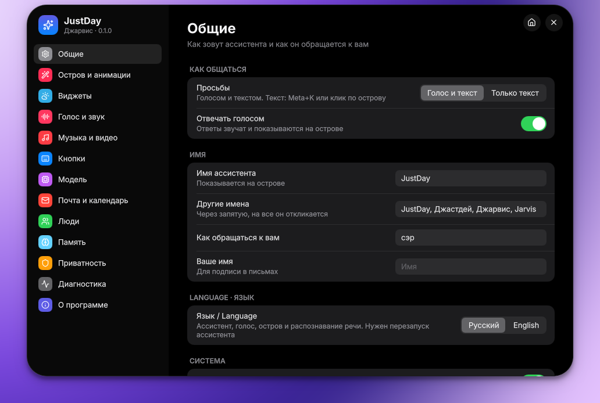<br><sub><b>Настройки</b> прямо в острове: 13 разделов</sub></td>
</tr>
</table>

## Голосом или с клавиатуры

| Клавиши | Что делают |
|---|---|
| <kbd>Meta</kbd>+<kbd>J</kbd> (или кнопка мыши) | говорить: нажать — слушает до паузы, зажать — пока держите. В режиме «только текст» — поле ввода |
| <kbd>Meta</kbd>+<kbd>K</kbd> | написать просьбу; выделенный на экране текст прикрепляется |
| <kbd>Meta</kbd>+<kbd>Y</kbd> / <kbd>Meta</kbd>+<kbd>N</kbd> | «да» / «нет» на вопрос острова: разрешить действие, отправить сообщение |
| <kbd>Meta</kbd>+<kbd>Shift</kbd>+<kbd>J</kbd>, двойное нажатие или «стоп» | отменить всё |
| В поле ввода: <kbd>Enter</kbd> · <kbd>Shift</kbd>+<kbd>Enter</kbd> · <kbd>↑</kbd> · <kbd>/</kbd> · <kbd>Esc</kbd> | отправить · новая строка · прошлые просьбы · команды · закрыть |

**Без микрофона** (школа, офис, библиотека): *Настройки → Общие → Просьбы → «Только текст»*. Микрофон не открывается, распознавание речи даже не загружается, а ответы можно оставить только текстом (*«Отвечать голосом»*). Все сочетания меняются в *Настройки → Кнопки*.

## Музыка и видео

«Джарвис, включи песню Believer» — через 3–5 секунд она играет, без лишних слов. JustDay находит песню на YouTube (оригинал, а не кавер или часовую нарезку), скачивает звук в `~/Music/JustDay/YouTube` и играет в своём плеере. В следующий раз песня звучит с диска, даже без интернета. Можно альбом или плейлист целиком («включи альбом Meteora»), исполнителя («включи Linkin Park»), вперемешку или на повтор.

- Пока играет музыка, сверху висит **живая пилюля**: обложка, название и эквалайзер в цвет обложки. Клик открывает плеер с перемоткой и очередью.
- «пауза», «дальше», «назад», «перемешай», «на повтор», «выключи повтор», «выключи музыку» работают мгновенно, без ИИ. В плеере те же кнопки и очередь: клик по песне включает её. Пока Джарвис слушает или говорит, музыка становится тише.
- Плеер — отдельная служба, поэтому музыка не прерывается, даже если перезапустить ассистента.

«Включи видео про чёрные дыры» — Джарвис найдёт ролик и **спросит, где его показать**:

- **В острове** — ролик загружается (до 720p) и играет прямо сверху экрана. Поверх него идут подписи ассистента, двойной клик открывает видео на весь экран.
- **В окне** — отдельный плеер mpv, стартует сразу.
- **YouTube** — страница в браузере, с комментариями.

Чтобы не спрашивал каждый раз, выберите вариант в *Настройки → Музыка и видео*.

## Студия

Скажите или напишите: «нарисуй логотип с прозрачным фоном», «оживи это фото», «сделай лоу-фай бит на 30 секунд», «преврати фото кресла в 3D-модель», «вырежи паузы из видео и сделай вертикальное для шортсов».

| Что | Как долго на RTX 3060 |
|---|---|
| Картинка, картинка без фона, увеличение ×4 | 10–40 с |
| Правка фото по словам | 1–2 мин |
| Музыка и песни (с вокалом) | ~15 с на 10 с трека |
| 3D-модель из текста или фото → GLB + STL | ~3 мин, в фоне |
| Видео из текста или фото | ~8 мин на 3 с, в фоне — JustDay сам скажет, когда готово |
| Озвучка вашим голосом ассистента, субтитры из речи | секунды |
| Монтаж: обрезать, склеить, музыка под видео, вшить субтитры, вертикальное 9:16, убрать паузы, ускорить, GIF, слайдшоу | секунды, ffmpeg |

Генерация идёт через локальный [ComfyUI](https://github.com/comfyanonymous/ComfyUI) с моделями FLUX.1-schnell, Qwen-Image-Edit, Wan 2.2, ACE-Step и Hunyuan3D. JustDay находит его сам (`~/ai-local/ComfyUI`, `~/ComfyUI` или `[studio] comfy_dir`), запускает только на `127.0.0.1` и в отдельной службе с лимитом памяти. Проверка: `justday studio status`. Монтаж, субтитры и озвучка работают и без видеокарты.

## Модели

| Провайдер | Цена | Что нужно |
|---|---|---|
| **Claude** (по умолчанию) | подписка Claude | вход в Claude Code — мастер поможет |
| **Бесплатная** — облако Ollama | бесплатно с лимитами | бесплатный аккаунт Ollama |
| **OpenRouter** `openrouter/free` | бесплатно, ~50 запросов в день | ключ OpenRouter |
| **DeepSeek** | дёшево | ключ DeepSeek |
| **Локальная** Ollama | бесплатно, ничего не уходит в сеть | видеокарта от 10 ГБ |
| Свой адрес | — | любой Anthropic-совместимый API (LiteLLM, vLLM…) |

Память, навыки и записная книжка общие для всех моделей. Смена: остров → меню → «Модель» или `justday model use <провайдер> <модель>`.

## Приватность

| Остаётся на компьютере | Уходит в облако |
|---|---|
| звук микрофона и распознавание речи, голос ассистента | текст ваших просьб и ответы — выбранной модели |
| письма, календарь, мгновенные команды | выделенный текст — только если он прикреплён к просьбе (видно в поле) |
| картинки, видео, музыка и 3D из студии | название города для погоды (Open-Meteo) |
| пароли и ключи — в системной связке ключей, не в памяти ассистента | |

Телеметрия Claude Code выключена. Опасные действия (удаление, `sudo`, форс-пуш…) ждут вашего подтверждения, а обычный запуск программ — нет. Подробнее — в [руководстве](docs/MANUAL.md).

## Команды

```bash
justday ask "открой дискорд"          # просьба текстом из терминала
justday compose                       # открыть поле ввода на острове
justday play "Imagine Dragons Believer"   # песня с YouTube в свой плеер (count=5 — несколько)
justday video "черные дыры" where=island  # видео: island | window | browser (без where — спросит)
justday play "Linkin Park Meteora" playlist=1 shuffle=1   # альбом вперемешку
justday player repeat one             # pause | next | prev | repeat off|all|one | shuffle on|off | seek 60 | volume 50
justday studio image "a red fox, watercolor" size=wide
justday studio vertical ~/Videos/clip.mp4
justday setup                         # мастер настройки заново
justday doctor                        # проверка всего
justday update                        # обновиться (остров подскажет, когда есть новое)
justday logs -f                       # что он слышит и делает
```

<details>
<summary><b>Частые вопросы</b></summary>

**Работает без видеокарты NVIDIA?** Да. Мастер выберет распознавание речи на процессоре (или режим «только текст»), простой голос Silero и облачную модель. Недоступны только живой голос, локальные модели и генерация в студии.

**Можно вообще без голоса?** Да: *Настройки → Общие → «Только текст»* и выключить *«Отвечать голосом»*. <kbd>Meta</kbd>+<kbd>K</kbd> открывает поле ввода.

**Он сам что-нибудь отправит или удалит?** Сообщения и письма — только после вашего «да». Удаление файлов, `sudo`, удаление программ и другие опасные действия — тоже с подтверждением.

**Другие окружения (GNOME, X11)?** Пока только KDE Plasma 6 на Wayland: остров, горячие клавиши и управление окнами завязаны на KWin.

**Где файлы из студии?** В `~/Pictures/JustDay`, `~/Videos/JustDay`, `~/Music/JustDay` и `~/Documents/JustDay/3D`; на острове есть кнопки «Открыть» и «Показать в папке».

</details>

📖 **[Полное руководство](docs/MANUAL.md)** — устройство, модели, голос, память, почта, игры, студия, безопасность, решение проблем.

## Участие

Баги и идеи — в [Issues](https://github.com/0nigiris/JustDay/issues). Код, комментарии и история коммитов — на английском; интерфейс — на русском и английском (`island/i18n`, `src/justday/i18n.py`). Скриншоты для README снимаются в изолированной сессии KWin: `tests/ui/readme_shots.sh`.

---

<a id="english"></a>

<p align="center"></p>

## English

**JustDay** is an AI assistant for Linux that **acts**, not just answers: it opens apps and sites, clicks buttons in windows, installs software, drafts messages and mail, generates pictures, edits videos, plays games and delegates coding to Claude Code. Talk to it or type — the answer shows up in a **Dynamic Island** at the top of the screen.

```bash
curl -fsSL https://raw.githubusercontent.com/0nigiris/JustDay/main/install.sh | bash
```

- **Voice or keyboard.** <kbd>Meta</kbd>+<kbd>J</kbd> to talk, <kbd>Meta</kbd>+<kbd>K</kbd> to type (the text you have selected on screen is attached), <kbd>Meta</kbd>+<kbd>Y</kbd>/<kbd>N</kbd> to answer the island. A **text-only mode** never opens the microphone — handy at school or in an office.
- **Its own music & video player.** “Play Believer” — the song is found on YouTube, downloaded and played right in the island (cover, equaliser, queue, instant “pause”/“next”). Videos play in the island, in a window or on YouTube — it asks where.
- **Local creative studio.** Pictures, photo edits, background removal, text/image-to-video, music with vocals, 3D models (GLB/STL), voice-over, subtitles and montage (cut, join, music, burned-in subtitles, 9:16, pause removal, GIF, slideshow) — on your own GPU through ComfyUI, free and offline.
- **Any model, free ones included:** Claude subscription, Ollama's free cloud models, OpenRouter's free tier, DeepSeek, local Ollama or any Anthropic-compatible endpoint. Memory, skills and the address book are shared across models.
- **Private by design:** speech recognition, the voice, mail, calendar and the studio run locally; Claude Code telemetry is off; secrets live in the system keyring. Messages are sent only after you confirm.
- **Installs software** through [JII](https://github.com/0nigiris/JII), plays Minecraft through its own bridge mod, remembers people and habits, speaks English and Russian.
- **Without an NVIDIA card** it still works: CPU speech recognition or text-only mode, the simple voice and a cloud model.

Requirements: KDE Plasma 6 on Wayland, PipeWire; an NVIDIA GPU is optional (needed for the neural voice, local models and the studio). The full manual is in Russian ([docs/MANUAL.md](docs/MANUAL.md)); the code, comments and commit history are in English.

## Лицензия · License

JustDay © 2026 [0nigiris](https://github.com/0nigiris) — **GNU GPL v3 или новее** ([LICENSE](LICENSE)): код можно менять и распространять, сохраняя авторство и открытый исходный код производных версий под GPL.

Сторонние части: иконки [Lucide](https://lucide.dev) (ISC); встроенные голоса созданы моделью Qwen3-TTS (Apache 2.0); идеи интерфейса вдохновлены Dynamic Island, компаньон-окном ChatGPT и Quick AI в Raycast.
