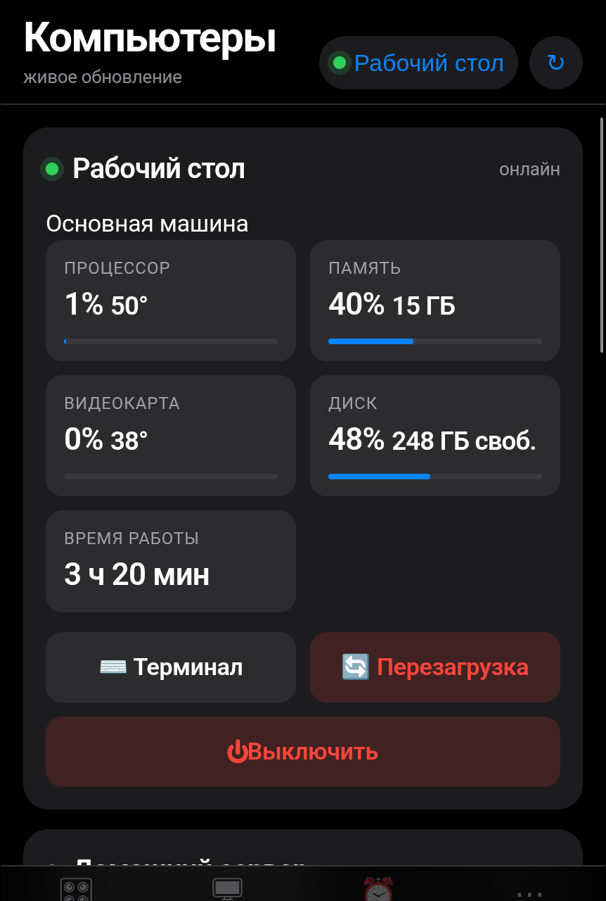
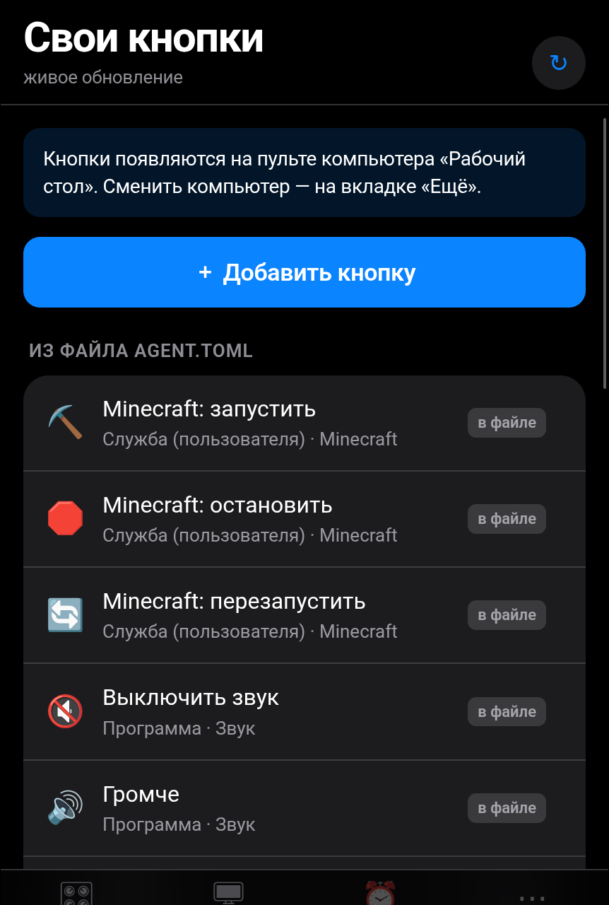
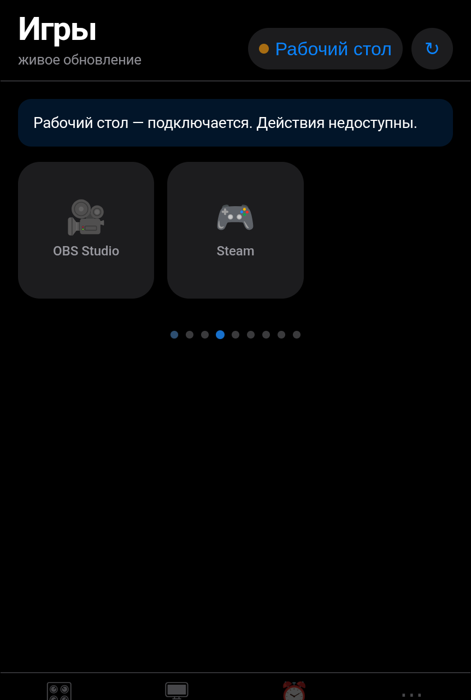

# Remo32

[](https://github.com/onigiri/remo32/actions/workflows/ci.yml)
[](LICENSE)
[](https://www.python.org/)

**Управление домашними компьютерами с телефона.** Посмотреть загрузку,
разбудить выключенный, погасить свет, запустить игру, открыть терминал —
из браузера или с иконки на рабочем столе телефона.

Плюс плата ESP32, которая делает то, чего не может ни одна программа:
**сама будит основной компьютер, если он перестал отвечать.** Даже когда
управлять уже нечем — контроллер лежит вместе с ним.

Не SaaS, не для чужих машин, не для интернета. Одна семья устройств, один
владелец, частная сеть.

<p align="center">
  
  
  
</p>

<p align="center"><sub>Снято на стенде с вымышленными машинами.</sub></p>

---

## Быстрый старт

```bash
git clone https://github.com/onigiri/remo32.git && cd remo32
./deploy/install.sh both      # спросит пароль и всё поставит
./deploy/install.sh check     # покажет, что живо
```

Открыть `http://127.0.0.1:8080`. Дальше — [MANUAL.md](MANUAL.md): как
пустить туда телефон, включить HTTPS и вход по отпечатку.

Плата не обязательна. Без неё работает всё, кроме сторожа: пробуждение
пойдёт напрямую из домашней сети.

---

## Что уже работает

| Возможность | Состояние |
|---|---|
| REST API контроллера: 23 операции + WebSocket терминала, OpenAPI | готово |
| Мобильный веб-интерфейс с живым обновлением | готово |
| Вход по паролю (argon2id) и по passkey (WebAuthn) | готово |
| Агент: статистика CPU, RAM, диски, сеть, температуры, GPU | готово |
| 19 предопределённых действий из примера конфигурации | готово |
| Свои кнопки прямо из интерфейса, без правки файлов | готово |
| Приложение для Android обновляется само, без магазина | готово, на телефоне не проверено |
| Кнопка на плате: включить ПК, выключить слежку | работает, нажатие на железе не проверено |
| Расписание: правила «в 23:00 погасить свет», правка с телефона | готово |
| Управление подсветкой через OpenRGB (корпус, память, клавиатура, мышь) | готово |
| Выключение и перезагрузка через агент | готово |
| Wake-on-LAN двумя независимыми путями | готово |
| Веб-терминал поверх tmux, переживающий обрыв связи | готово |
| Симулятор ESP32: mock, HTTP и MQTT | готово |
| Сторож основного ПК в прошивке: сам будит его при пропаже | **проверено на железе 2026-09-08: ПК проснулся сам** |
| Прошивка ESP32-S3 (без PSRAM) | залита в плату, консоль и NVS проверены |
| Переключение KVM | абстракция готова, железа нет |

230 автоматических тестов, `ruff` и `mypy --strict` без замечаний.

---

## Архитектура вкратце

```
ТЕЛЕФОН → Tailscale → КОНТРОЛЛЕР ─→ агент основного ПК (тот же компьютер)
                      (на основном  ─→ агент второго ПК + magic packet
                       ПК, включён   ─→ ESP32: сторож основного ПК
                       постоянно)
```

Агенты делают всё, что должно происходить внутри операционной системы.
ESP32 делает то, что требует присутствия в домашней сети. Контроллер сам
ничего не исполняет.

**Контроллер живёт на основном ПК, который включён постоянно.** Он же будит
второй (шумный) ПК по домашней сети. У этой схемы есть очевидный провал:
если основной ПК умрёт, командовать побудкой некому — контроллер лежит
вместе с ним. Поэтому плата ESP32 работает не пультом, а сторожем: пингует
основной ПК и, если тот молчит дольше заданного времени, отправляет magic
packet сама, без телефона и без контроллера.

Планы и что требуется от владельца: [ROADMAP.md](ROADMAP.md).

Как этим пользоваться каждый день, где что лежит и что делать, когда
сломалось: [MANUAL.md](MANUAL.md).

Подробно, с обоснованием решений: [ARCHITECTURE.md](ARCHITECTURE.md).

---

## Требования

* Linux (проверено на Fedora 42+)
* Python 3.12+ и [uv](https://docs.astral.sh/uv/)
* `tmux` — для терминала и фоновых действий
* Tailscale — для доступа снаружи дома
* ESP-IDF 5.2+ — только если собираете прошивку

Проверить окружение:

```bash
uv --version && python3 --version && tmux -V && tailscale version
```

---

## Установка

### 1. Зависимости

```bash
git clone <репозиторий> ~/Remo32
cd ~/Remo32
uv sync
```

### 2. Агент — на каждом управляемом ПК

```bash
./deploy/install.sh agent
```

Скрипт создаст `~/.config/remo32/agent.toml`, сгенерирует токен в
`~/.config/remo32/agent.env` (права 0600) и установит пользовательскую
службу systemd. **Запишите напечатанный токен** — он понадобится
контроллеру.

Отредактируйте `~/.config/remo32/agent.toml`:

```toml
agent_id = "desktop"
display_name = "Основной ПК"

[server]
# Чтобы контроллер достучался, укажите адрес Tailscale этой машины:
host = "100.64.0.10"     # tailscale ip -4
port = 8765
```

Запуск:

```bash
systemctl --user enable --now remo32-agent
systemctl --user status remo32-agent
```

**Обязательно** — иначе службы стартуют только после входа в систему:

```bash
loginctl enable-linger $USER
loginctl show-user $USER --property=Linger   # должно быть Linger=yes
```

`./deploy/install.sh` делает это сам. Для машины, которая перезагружается
раз в неделю и управляется с телефона, забыть об этом означает: после
перезагрузки до неё уже не достучаться.

### 3. Разрешение на выключение

Агент работает от обычного пользователя и по умолчанию не может выключить
машину, если в системе есть другие сеансы. Правило polkit выдаёт ровно два
разрешения и ничего больше:

```bash
./deploy/install.sh polkit      # запросит sudo один раз
```

### 4. Контроллер — на одной машине

```bash
./deploy/install.sh controller
```

Скрипт спросит пароль для веб-интерфейса и сохранит его argon2-хэш.
Затем откройте `~/.config/remo32/controller.toml`:

```toml
[server]
host = "100.64.0.10"     # адрес Tailscale, НЕ 0.0.0.0
port = 8080

[[pcs]]
id = "desktop"
name = "Основной ПК"
agent_url = "http://100.64.0.10:8765"
agent_token_env = "REMO32_AGENT_TOKEN_DESKTOP"
mac_address = "5c:f9:dd:11:22:33"        # cat /sys/class/net/enp3s0/address
broadcast_address = "192.168.1.255"
```

И впишите токены агентов в `~/.config/remo32/controller.env`:

```
REMO32_AGENT_TOKEN_DESKTOP=токен-с-первого-ПК
REMO32_AGENT_TOKEN_SERVER=токен-со-второго-ПК
```

Запуск:

```bash
systemctl --user enable --now remo32-controller
```

Открыть с телефона: `http://100.64.0.10:8080`. С HTTPS (см. «HTTPS и
passkey» ниже) адрес станет `https://имя-машины.ts.net`, без порта.

---

## Разработка

```bash
uv sync                                   # зависимости
uv run pytest tests/ -q                   # тесты
uv run ruff check . && uv run ruff format --check .
uv run mypy packages tests

# запуск вручную
uv run remo32-agent --check               # проверить конфигурацию
uv run remo32-agent --host 127.0.0.1 --port 8765
uv run remo32-controller --host 127.0.0.1 --port 8080
```

Полезные ключи:

```bash
uv run remo32-agent --generate-token      # новый токен агента
uv run remo32-controller --hash-password  # хэш пароля
uv run remo32-controller --gen-secret     # ключ подписи сессий
```

Документация API — на `/docs` работающего контроллера (Swagger UI).

---

## Симулятор ESP32

Позволяет разрабатывать и проверять всё, не имея платы под рукой.

```bash
# HTTP-режим: ведёт себя как плата в домашней сети
uv run remo32-espsim --host 127.0.0.1 --port 8090

# MQTT-режим: как плата, подключённая к брокеру
uv run remo32-espsim --mode mqtt --mqtt-host 127.0.0.1 --mqtt-port 1883

# Настоящий magic packet: пробуждение заработает ещё до появления платы
uv run remo32-espsim --real-wol
```

Направить контроллер на симулятор:

```toml
[esp32]
transport = "http"
base_url = "http://127.0.0.1:8090"
```

Управление неисправностями (ручки есть только у симулятора):

```bash
# плата «пропала»
curl -X POST -H 'Content-Type: application/json' \
     -d '{"offline":true}' localhost:8090/sim/faults

# потеря Wi-Fi
curl -X POST -H 'Content-Type: application/json' \
     -d '{"wifi_lost":true}' localhost:8090/sim/faults

# каждая третья команда завершается ошибкой
curl -X POST -H 'Content-Type: application/json' \
     -d '{"failure_rate":0.33}' localhost:8090/sim/faults

# «ПК включился» — изменился уровень на входе
curl -X POST -H 'Content-Type: application/json' \
     -d '{"pin":4,"level":true}' localhost:8090/sim/pin

# текущее состояние симуляции
curl localhost:8090/sim/state
```

Брокер для проверки MQTT:

```bash
podman run -d --rm --name remo32-mqtt -p 1883:1883 \
  -v "$PWD/deploy/mosquitto.conf:/mosquitto/config/mosquitto.conf:Z" \
  docker.io/library/eclipse-mosquitto:2
```

Симулятор всегда сообщает `simulated: true`, и интерфейс это показывает.
**Успешный вызов в симуляторе ничего не говорит о работоспособности
железа.**

---

## Прошивка ESP32

См. [firmware/README.md](firmware/README.md) — сборка, заливка, настройка
через последовательный порт.
Схема подключения: [docs/HARDWARE.md](docs/HARDWARE.md).

Коротко:

```bash
cd firmware
. ~/esp/esp-idf-525/export.sh
idf.py set-target esp32s3
idf.py build
idf.py -p /dev/ttyACM0 flash monitor
```

Затем в консоли платы: `wifi <ssid> <пароль>`, `token <секрет>`, `save`,
`restart`.

---

## Tailscale

Контроллер **не должен** быть доступен из интернета. Правильная схема:

1. Установить Tailscale на оба ПК и на телефон, войти одним аккаунтом.
2. Узнать адрес: `tailscale ip -4`.
3. Указать этот адрес в `server.host` контроллера и агентов.
4. Открывать интерфейс по `http://100.x.y.z:8080`.

### HTTPS и passkey

Passkey требует защищённого соединения. В Tailscale это делается так:

1. В админке https://login.tailscale.com/admin/dns включить
   **HTTPS Certificates**.
2. Получить сертификат:

   ```bash
   tailscale cert desktop.tailnet-abc123.ts.net
   ```

3. Прописать в конфигурации:

   ```toml
   [server]
   public_origin = "https://desktop.tailnet-abc123.ts.net"

   [auth]
   webauthn_rp_id = "desktop.tailnet-abc123.ts.net"
   ```

4. Поставить сертификат перед контроллером (например, `caddy` или
   `nginx`), либо использовать `tailscale serve`:

   ```bash
   sudo tailscale serve --bg --https=443 http://127.0.0.1:8080
   ```

   `sudo` нужен, пока не задан оператор: `tailscale set --operator=$USER`.
   Проверить — `tailscale serve status`, должно быть «tailnet only».
   `funnel` вместо `serve` открыл бы пульт всему интернету; не используйте.

5. Развернуть контроллер за прокси. Это обязательный шаг, без него
   `serve` отвечает **502**: он стучится строго в `127.0.0.1`, а
   контроллер по умолчанию слушает адрес Tailscale.

   ```toml
   [server]
   host = "127.0.0.1"          # было 100.x.y.z
   public_origin = "https://desktop.tailnet-abc123.ts.net"

   [auth]
   cookie_secure = true        # cookie только по HTTPS
   ```

   После перезапуска прямой `http://100.x.y.z:8080` перестанет
   отвечать — это и требуется: остаётся один вход, через HTTPS.

### Проверьте чужие устройства

```bash
tailscale status
```

Узлы с чужим доменом (`*.tailXXXXX.ts.net`, отличным от вашего) — это
устройства, расшаренные в вашу сеть другими людьми. Они видят ваши
сервисы. Убрать: https://login.tailscale.com/admin/machines

Именно поэтому Remo32 требует вход даже внутри Tailscale.

---

## Модель безопасности

| Рубеж | Что защищает |
|---|---|
| Tailscale | Скрывает систему от интернета |
| Passkey / пароль + сессия | Проверяет, что это владелец |
| Токен агента | Проверяет, что запрос от контроллера |
| Предопределённые действия | Через API нельзя выполнить произвольную команду |
| Двойной выключатель терминала | Оболочка требует разрешения и в контроллере, и в агенте |
| Журнал аудита терминала | Видно, когда и что вводилось |
| Обычный пользователь, не root | Ограничивает последствия любой ошибки |

Что система **не** делает:

* не предоставляет ручку «выполни эту команду»;
* не запускает ничего от root;
* не работает без аутентификации ни в одном режиме;
* не хранит секреты в конфигурационных файлах и в git.

Подробнее — раздел 4 в [ARCHITECTURE.md](ARCHITECTURE.md).

---

## Добавление своих действий

Двумя способами, и они не конкурируют.

**Из интерфейса** — «Ещё» → «Свои кнопки». Кнопка появляется сразу,
перезапускать ничего не нужно. Форма спрашивает программу и аргументы
раздельно: кнопка — это команда, которую машина выполнит, и поле
«командная строка» означало бы, что через интерфейс можно выполнить что
угодно одной строкой. Заведённое здесь лежит в
`~/.config/remo32/actions.toml`, его пишет программа.

Выключается целиком: `actions_editor.enabled = false`.

**В файле** — `~/.config/remo32/agent.toml`, перезапустить агент. Там ваши
комментарии и порядок, и программа туда не пишет: в интерфейсе такие
кнопки помечены «в файле» и доступны только на чтение. Правки кода не
требуются ни в одном из способов.

**Запуск программы** (без оболочки):

```toml
[[actions]]
id = "firefox"
name = "Firefox"
kind = "desktop"
argv = ["firefox"]
icon = "🦊"
group = "Программы"
```

**Долгий процесс в tmux** (переживает обрыв связи, доступен из терминала):

```toml
[[actions]]
id = "claude"
name = "Claude Code"
kind = "tmux"
session = "claude"
workdir = "~/JII"
argv = ["claude", "-c"]
icon = "🤖"
```

**Служба systemd**:

```toml
[[actions]]
id = "mc-restart"
name = "Minecraft: перезапуск"
kind = "systemd_user"
unit = "minecraft.service"
verb = "restart"
dangerous = true          # интерфейс спросит подтверждение
```

**Своя логика — скриптом**:

```toml
[[actions]]
id = "backup"
name = "Бэкап"
kind = "shell_script"
script = "/home/oni/.local/share/remo32/scripts/backup.sh"
```

Виды действий: `exec`, `desktop`, `tmux`, `systemd_user`,
`systemd_system`, `shell_script`. Произвольную строку для оболочки
конфигурация не принимает намеренно — см. ARCHITECTURE, раздел 4.

Если программа не установлена, кнопка будет неактивной, а не выдаст
ошибку после нажатия.

---

## Расписание

Правила «в такое-то время выполнить действие» создаются прямо в интерфейсе:
карточка **⏰ Расписание** → кнопка `+`. Время, дни недели, ПК и действие.
Дни не выбраны — правило работает каждый день.

Хранится в `<data_dir>/schedules.json` и переживает перезагрузку. Кнопка
«Выполнить сейчас» запускает правило вручную, не отменяя плановое
срабатывание.

Особенности, о которых стоит знать:

* Если контроллер лежал в момент срабатывания, правило выполнится с
  опозданием, но не более чем на 15 минут. Иначе ПК, включённый в полдень,
  немедленно выполнил бы ночное правило.
* Ошибка действия (ПК выключен, программы нет) записывается в правило и
  видна в интерфейсе, но не останавливает остальные правила.

### Ночной режим на этом ПК

Подсветкой управляет OpenRGB через готовые профили `~/.config/OpenRGB/*.orp`.
Действия `rgb-off` и `rgb-on` применяют профили `off` и `white`.

**Обязательно:** OpenRGB должен быть запущен с ключом `--server`, иначе
каждый вызов заново инициализирует шину i2c — около 20 секунд вместо одной,
да ещё и конфликтует с открытым окном программы. Правится в
`~/.config/autostart/OpenRGB.desktop`:

```ini
Exec=/usr/bin/openrgb --startminimized --server --profile "white"
```

Проверить: `time openrgb --profile off` — должно занимать около секунды и
писать `Client: ... controllers received`.

---

## Сторож основного ПК

Контроллер работает на основном ПК, поэтому себя разбудить не может. Плата
делает это сама. Настраивается в её последовательной консоли:

```
guard --on --host 192.168.1.10 --mac 5c:f9:dd:11:22:33 --bcast 192.168.1.255
guard --grace 10 --retry 15 --tries 3
save
```

* `--host` — адрес основного ПК в домашней сети (лучше закрепить в роутере);
* `--grace` — сколько минут молчания считать пропажей;
* `--retry` — пауза между попытками, `--tries` — сколько их всего;
* `guard` без аргументов покажет текущее состояние;
* `guard --snooze 60` — не вмешиваться час (то же делает контроллер перед
  плановым выключением).

В конфигурации контроллера у охраняемого ПК нужно указать:

```toml
guarded_by_esp32 = true
guard_snooze_minutes = 480
```

Без этого плата примет ваше выключение за аварию и включит компьютер обратно.

---

## Диагностика

### Контроллер не видит ПК

```bash
# 1. Жив ли агент на той машине
curl http://АДРЕС_АГЕНТА:8765/ping

# 2. Принимает ли он токен
curl -H "X-Remo32-Agent-Token: ТОКЕН" http://АДРЕС_АГЕНТА:8765/api/health

# 3. Что говорит агент
systemctl --user status remo32-agent
journalctl --user -u remo32-agent -n 50
```

Ответ **502 `agent_unauthorized`** означает, что токены на двух машинах
разошлись. Это не выход из системы: интерфейс продолжит работать.

### Не работает Wake-on-LAN

```bash
sudo ethtool enp3s0 | grep Wake-on        # должно быть "g"
```

Если `d` — включите в BIOS и настройте `ethtool` (см. `docs/HARDWARE.md`).
Проверьте, что `broadcast_address` соответствует вашей подсети
(`ip -o -4 addr show | grep brd`), а контроллер находится в той же сети.

Ответ содержит, какой путь сработал:

```json
{"attempts": [{"method": "direct", "ok": true},
              {"method": "esp32", "ok": false, "error": "..."}]}
```

### Не открывается терминал

Он должен быть разрешён **в двух местах**:

```toml
# ~/.config/remo32/controller.toml
[[pcs]]
terminal_enabled = true

# ~/.config/remo32/agent.toml
[terminal]
enabled = true
```

И на машине должен быть установлен `tmux`.

### Passkey не предлагается

Нужны три условия: HTTPS, заданный `auth.webauthn_rp_id` и хотя бы один
зарегистрированный ключ. Зарегистрировать: войти по паролю → меню `⋯` →
пункт 1.

При смене адреса контроллера passkey перестанут работать — входите
паролем и регистрируйте заново.

### Забыт пароль

```bash
uv run remo32-controller --hash-password
# заменить REMO32_PASSWORD_HASH в ~/.config/remo32/controller.env
systemctl --user restart remo32-controller
```

### Полезные команды

```bash
journalctl --user -u remo32-controller -f
journalctl --user -u remo32-agent -f
curl http://127.0.0.1:8080/api/health | python3 -m json.tool
uv run remo32-agent --check
uv run remo32-controller --check
```

Каждый ответ API содержит `request_id`. По нему одна и та же операция
находится в логах контроллера и агента.

---

## Что осталось

* Ввести на плате Wi-Fi и токен (`wifi`, `token`, `save`) — остальное уже
  настроено и сохранено. Без сети страховки от смерти основного ПК нет.
* Собрать схему с оптроном для чтения состояния питания (не обязательно:
  сторож работает по пингу, провода нужны только для точного индикатора).
* Windows и macOS — код написан по документации, не проверен.

---

## Участие

Замечания и предложения — в issues. Перед отправкой изменений:

```bash
uv run pytest -q && uv run ruff check . && uv run mypy packages
```

Подробнее — [CONTRIBUTING.md](CONTRIBUTING.md).

---

## Лицензия

[GNU GPL v3](LICENSE). Коротко: пользуйтесь, меняйте, распространяйте —
но производные работы тоже должны оставаться свободными.

Гарантий нет никаких. Программа выключает и включает настоящие
компьютеры; ответственность за это лежит на том, кто её запустил.
