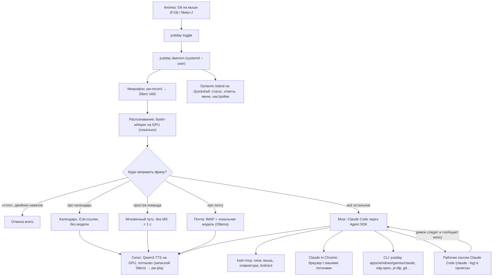

# JustDay: полное руководство

JustDay — голосовой ИИ-агент для Linux-компьютера с KDE Plasma 6 (Wayland). Нажимаешь кнопку, говоришь, и он делает: открывает приложения и сайты, управляет окнами, мышью и клавиатурой, ищет файлы, запускает и играет в игры, читает почту и календарь, раздаёт задачи Claude Code и проверяет их работу.

Название: в «Железном человеке» после JARVIS появилась FRIDAY; здесь — JustDay (по аналогии с проектом Just Install It). Ассистент откликается сразу на несколько имён: основное `user.assistant_name` (по умолчанию «Джарвис») и дополнительные `user.assistant_aliases` (по умолчанию «JustDay»).

Интерфейс, голос и ответы бывают **на русском или на английском** (`user.language`, выбирается первым шагом мастера или в Настройки → Общие). *English speakers: pick English in the setup wizard — the island, settings, spoken replies, instant commands, mail and calendar all switch to English.*

Содержание:
1. [Как это устроено](#1-как-это-устроено)
2. [Что уходит в облако, а что остаётся на компьютере](#2-что-уходит-в-облако-а-что-остаётся-на-компьютере)
3. [Установка](#3-установка)
4. [Как пользоваться](#4-как-пользоваться)
5. [Модели: как выбрать и поменять](#5-модели-как-выбрать-и-поменять)
6. [Память](#6-память)
7. [Почта и календарь](#7-почта-и-календарь)
8. [Безопасность и разрешения](#8-безопасность-и-разрешения)
9. [Настройки (config.toml)](#9-настройки-configtoml)
10. [Из чего собран проект](#10-из-чего-собран-проект)
11. [Как расширять](#11-как-расширять)
12. [Скорость: куда уходит время](#12-скорость-куда-уходит-время)
13. [Диагностика и частые проблемы](#13-диагностика-и-частые-проблемы)
14. [Планы](#14-планы)
15. [Обновление и удаление](#15-обновление-и-удаление)

---

## 1. Как это устроено

JustDay — не новый фреймворк агентов. Агентный цикл, инструменты (терминал, файлы, веб), MCP-серверы, навыки, память, сессии, сжатие контекста и система разрешений уже есть в **Claude Code**. JustDay — это тонкий голосовой слой вокруг него плюс «руки» для рабочего стола и приватные локальные модули.



### Путь одной фразы

1. **Кнопка.** KDE ловит F19 (G6, перепрошитая через libratbag) или Meta+J и запускает `justday toggle`. Команда передаёт нажатие демону через Unix-сокет `$XDG_RUNTIME_DIR/justday.sock`.
2. **Запись.** Демон слушает микрофон через PipeWire. Детектор речи Silero VAD понимает, когда вы замолчали (1 с тишины или пауза, подобранная под ваш темп). Если кнопку зажать, запись идёт, пока держите.
3. **Проверка голоса** (если включена, [раздел 4](#под-мой-голос)): отпечаток голоса сравнивается с вашим, чужие фразы отбрасываются.
4. **Распознавание.** Whisper large-v3-turbo на видеокарте переводит речь в текст примерно за 0,5 с. Звук никуда не отправляется. Типичные «галлюцинации» Whisper на тишине («Субтитры сделал…», «Продолжение следует») отбрасываются.
5. **Маршрутизация** (`daemon.handle_utterance`):
   - ждём подтверждения опасного действия → «да» или «нет»;
   - «стоп», «отмена» (stop, cancel) → отменить всё;
   - **утренний брифинг** (`briefing.py`) → первое за день «привет» или «доброе утро»: погода, ближайшая встреча, письма и просроченные напоминания одной фразой, без обращения к модели. Второе «привет» за день отвечает уже мозг;
   - **голос** → «молчи», «отключи голос», «говори»: ассистент перестаёт (или снова начинает) озвучивать ответы, остров показывает их как обычно;
   - **мгновенный путь** (`fastpath.py`) → «открой/закрой/сверни X», «громче», «пауза», «громкость 50», «заблокируй экран» (и по-английски: open, close, minimize, volume 50, pause, lock screen); выполняется за 0,1–1 с без ИИ;
   - **почта** (`mail.py`) → любые фразы про почту и письма; обрабатываются полностью локально;
   - **календарь** (`calendar_lane.py`) → «что у меня сегодня», «какие встречи завтра»; тоже локально;
   - мозг занят → новая фраза вливается в текущий ход, прошлая задача не отменяется;
   - иначе → новый ход мозга.
6. **Мозг.** Постоянная сессия Claude Code (`brain.py`) с персоной `brain/PERSONA.md` (или `PERSONA.en.md` для английского), профилем `CLAUDE.md`, навыками из `plugin/skills` и MCP-серверами. Модель сама решает, какие инструменты вызвать.
7. **Ответ.** Вслух произносится только итоговый текст хода. Промежуточные мысли показываются на Dynamic Island. Успешные действия без вопроса проходят молча, с коротким звуком. Отмена в любой момент (даже пока фраза ещё распознаётся) гасит и действие, и ответ.
8. **Фоновые задачи.** Работу с кодом мозг поручает отдельным сессиям Claude Code (`justday claude start`). Демон каждые 15 с проверяет их состояние и, когда сессия закончила или ждёт вас, отдаёт мозгу событие. Мозг сам смотрит diff и тесты, при необходимости «подпинывает» Claude и докладывает голосом.

### Управление рабочим столом

- **Команды:** `justday apps launch|find`, `justday windows list|focus|close|minimize` (скрипты KWin), `justday games`, `xdg-open`, `playerctl`, `wpctl`.
- **GUI** через [kwin-mcp](https://github.com/VibeProgramm/kwin-mcp): ввод идёт через KWin EIS, дерево доступности через AT-SPI. Поверх него JustDay добавляет два инструмента (`plugin/bin/kwin_live.py`):
  - `look` сразу возвращает картинку активного окна. На картинке пронумерованы кнопки Qt/GTK-приложений, их координаты берутся из дерева доступности.
  - `act` за один вызов выполняет серию шагов (`click #12`, `click 410 88`, `type Привет`, `key ctrl+k`, `drag …`, `wait 300`) и возвращает новую картинку.
  - Для игр у `act` есть шаги реального времени: `press w 800` (держать клавишу 0,8 с), `turn 300 0 250` (повернуть камеру относительным движением мыши за 250 мс), `mouse down right` / `mouse up right`. Подробнее — [«Игры»](#игры).

  Модель не пересчитывает координаты и не тратит отдельный ход на каждый клик. Текст вставляется одной вставкой из буфера обмена (в терминалах Ctrl+Shift+V), без лишнего Enter; прежнее содержимое буфера возвращается.
- **Браузер:** расширение Claude in Chrome управляет вашим браузером (Helium, Chrome, Chromium) с уже выполненными входами.

---

## 2. Что уходит в облако, а что остаётся на компьютере

Короткий ответ: **звук, распознавание, синтез речи, мгновенные команды и почта не покидают компьютер**. В облако (при провайдере `claude`) уходит то, что видит мозг: текст ваших просьб и всё, что он прочитал инструментами.

| Данные | Где обрабатываются |
|---|---|
| Звук с микрофона | Только локально (Whisper). Не сохраняется. |
| Распознанный текст просьбы | Уходит мозгу, то есть в облако, если просьба дошла до мозга |
| Отпечаток голоса и записи для настройки под ваш голос | Только локально (`~/.local/share/justday/voiceprint/`) |
| Календарь: события, названия встреч | Только локально. iCal-ссылка хранится в связке ключей, события скачиваются прямо с сервера календаря, мозгу запрещён `justday calendar`. |
| Системные уведомления, показанные на острове | Только локально: демон видит их копию на шине D-Bus и никуда не отправляет, в журнал не пишет |
| Выделенный текст (Meta+K) | Уходит мозгу только вместе с просьбой, если плашка «Выделенное» не убрана |
| Студия: картинки, видео, музыка, 3D, субтитры | Только локально (ComfyUI на `127.0.0.1`, ffmpeg, Whisper) |
| Погода | В Open-Meteo уходит только название города (раз в 15 минут), если город задан |
| Проверка обновлений | `git fetch` с GitHub раз в 6 часов; ничего о вас не отправляется |
| Мгновенные команды («открой дискорд», «громче») | Выполняются локально. В следующее сообщение мозгу добавляется короткая пометка, что команда выполнена, чтобы работали фразы вроде «закрой его». |
| Почта: письма, отправители, темы, черновики | Только локально (IMAP + Ollama). Мозгу запрещено вызывать `justday mail`, коннекторы claude.ai Gmail/Drive/Calendar выключены. |
| Пароли и API-ключи | Связка ключей KDE Wallet / GNOME Keyring. Мозгу запрещены `secret-tool` и `justday secret`, а также чтение `~/.ssh`, `~/.gnupg`, `*.key` и хранилища ключей. |
| Персона, профиль `CLAUDE.md`, файлы памяти | Уходят мозгу при каждом новом разговоре: это его контекст |
| Результаты инструментов: вывод команд, прочитанные файлы, скриншоты `look`, веб-страницы | Уходят мозгу. Скриншот попадает в облако только когда мозг сам решил посмотреть на экран. |
| Код проектов, над которыми работают сессии Claude Code | Уходит в облако (так работает Claude Code) |
| Журнал событий `events.jsonl`, логи | Только локально |
| Телеметрия Claude Code (метрики, отчёты об ошибках, опросы, /feedback) | Выключена в `brain/settings.json` |

**Сколько Anthropic хранит данные** (по [документации](https://code.claude.com/docs/en/data-usage), тарифы Free/Pro/Max):
- если в [настройках приватности](https://claude.ai/settings/data-privacy-controls) выключено «использовать мои данные для улучшения моделей», хранение 30 дней;
- если включено, 5 лет, и данные могут использоваться для обучения.

Проверьте этот переключатель: это самое важное действие для приватности при работе с Claude.

**Классификатор auto-режима.** Перед каждым неразрешённым действием (команда, клик) отдельная модель Anthropic проверяет безопасность. Она видит ваши сообщения, вызовы инструментов и `CLAUDE.md`, но не результаты инструментов.

**Полностью локальный режим:** `justday model use ollama qwen3.5:9b`. Тогда и мозг работает на вашей видеокарте, а в интернет обращаются только инструменты, которые сами туда ходят (веб-поиск, yt-dlp, браузер). Цена этого режима описана в [разделе 5](#5-модели-как-выбрать-и-поменять).

---

## 3. Установка

### Требования
- Linux с **KDE Plasma 6 на Wayland**, PipeWire. Проверено на Fedora 44; установщик знает dnf, apt и pacman.
- **Видеокарта NVIDIA** желательна. Whisper работает и на CPU (поставьте `stt.model = "small"`), но медленнее. Для локальной модели нужно от 10 ГБ видеопамяти (RTX 3060 12 ГБ подходит).
- Аккаунт Claude (Pro/Max) **или** ключ другого провайдера, **или** только локальная модель.
- Около 15 ГБ диска: зависимости ~2 ГБ, Whisper ~1,6 ГБ, Ollama ~1,4 ГБ, Qwen 3.5 9B 6,6 ГБ.

### Одна команда

```bash
curl -fsSL https://raw.githubusercontent.com/0nigiris/JustDay/main/install.sh | bash
```
или из клона: `git clone https://github.com/0nigiris/JustDay ~/JustDay && ~/JustDay/install.sh`.

Установщик идемпотентный, повторный запуск ничего не ломает. Что он делает:
1. Переносит старую установку под именем `jarvis`, если она есть (`scripts/migrate-from-jarvis.sh`).
2. Ставит недостающие системные пакеты через sudo: `pipewire-utils`, `wl-clipboard`, `playerctl`, `yt-dlp`, `plocate`, `fd`, `ripgrep`, `jq`, `spectacle`, `libnotify`, `espeak-ng`, `kitty`, `ImageMagick`, `zstd`, `libsecret`, `gtk4-layer-shell`, `python3-gobject`, `python3-cairo`, `qdbus-qt6`, `dbus-tools`, а также заголовки для сборки kwin-mcp (`gcc`, `pkgconf`, `dbus-devel`, `glib2-devel`, `cairo-devel`, `cairo-gobject-devel`, `gobject-introspection-devel`, `at-spi2-core-devel`). Для apt и pacman имена пакетов подставляются автоматически.
3. Ставит `uv`, если его нет, и Claude Code официальным установщиком.
4. Ставит kwin-mcp через `uv tool`, версия закреплена: `plugin/bin/kwin_live.py` опирается на его внутренности.
5. Создаёт Python-окружение (`uv sync`: faster-whisper, torch CPU для Silero, Agent SDK, openWakeWord) и команды `justday` и `jarvis` в `~/.local/bin`.
6. Пишет `~/.config/justday/config.toml` (находит USB-микрофон) и профиль `~/.local/share/justday/brain/CLAUDE.md`.
7. Включает сервисы `justday.service` (демон) и `justday-island.service` (Dynamic Island на Quickshell; сам Quickshell установщик ставит: на Fedora — из COPR, на Arch — из репозитория).
8. Регистрирует горячие клавиши KDE: Meta+J и F19 для разговора, Meta+Shift+J для отмены. При переустановке ваши сочетания не трогает.
9. При первой установке запускает **мастер настройки** `justday setup` (8 шагов, Enter оставляет значение по умолчанию):
   1. язык: русский или English;
   2. имя ассистента и как обращаться к вам;
   3. модель: Claude (откроет вход, если нужно), локальная (сама поставит Ollama + Qwen), OpenRouter или DeepSeek (попросит ключ);
   4. голос: нейросетевой (сам поставит Qwen3-TTS, ~4 ГБ) или простой Silero;
   5. микрофон (по умолчанию остаётся текущий);
   6. кнопки;
   7. почта (по желанию);
   8. город для погоды на острове.

   Установщик проверен на чистой Fedora 44 в контейнере (Podman): от пустой системы до собранного kwin-mcp и готового окружения.

   Мастер можно запустить снова в любой момент, всё то же есть в настройках острова.

Дополнительные компоненты можно поставить и без мастера: `scripts/setup-local-llm.sh` (локальная модель), `scripts/setup-voice.sh` (нейроголос), или `JUSTDAY_LOCAL_LLM=1 JUSTDAY_VOICE=1 ./install.sh`.

### После установки
Мастер уже провёл по основным шагам. Что стоит проверить:
1. **Вход в Claude** (если выбран Claude): `claude`, затем `/login`.
2. **Браузер:** поставьте расширение «Claude» в Chromium-браузер и один раз выполните `claude --chrome`.
3. **Почта и календарь** (по желанию): Настройки → Почта и календарь, или `justday mail setup` и `justday calendar setup` ([раздел 7](#7-почта-и-календарь)).
4. **Кнопка на мыши** (по желанию):
   - **Logitech с libratbag (G502 и др.):** назначьте кнопке клавишу F19:
     ```bash
     ratbagctl list                                  # имя мыши, например singing-hare
     for p in 0 1 2 3 4; do ratbagctl singing-hare profile $p button 5 action set key KEY_F19; done
     ```
     Номер кнопки: G6 (DPI Shift) у G502 — это `button 5`. F13 не подходит: в KDE это клавиша «Tools», она открывает Системные настройки. Вернуть как было: `action set special resolution-alternate`.
   - **Обычная боковая кнопка:** `scripts/setup-hotkey.sh Meta+J --mouse ExtraButton1`.
5. **Проверка:** `justday doctor`.

---

## 4. Как пользоваться

### Кнопки
| Действие | Что происходит |
|---|---|
| Нажать и отпустить G6 / Meta+J | Слушает до паузы в речи |
| Зажать | Слушает, пока держите |
| Нажать ещё раз во время записи | Закончить фразу сейчас |
| **Двойное нажатие** | **Отменить всё**: речь, запись, текущую задачу, ожидание подтверждения |
| Meta+Shift+J или сказать «стоп» | То же самое |
| Новое нажатие, пока JustDay работает | Новая просьба добавляется к текущей работе, старая не отменяется |
| **Meta+K** | Поле ввода на острове (см. «Без микрофона: с клавиатуры») |
| **Meta+Y / Meta+N** | «Да» / «нет» на вопрос острова: разрешить действие, отправить сообщение, первый вариант ответа |

Все сочетания меняются в Настройки → Кнопки или `justday hotkey set --talk Meta+J --cancel Meta+Shift+J --type Meta+K --yes Meta+Y --no Meta+N` (пустое значение — не регистрировать).

### Меню и уведомления

Клик по острову открывает **меню**:
- сверху время, дата и погода, строка запроса (клик или <kbd>Meta</kbd>+<kbd>K</kbd>) и микрофон;
- «Сейчас играет»: наш плеер или любой другой (браузер, Spotify) — обложка, кнопки, перемешивание и повтор; если ничего не играет, есть «Включить» и «Моя музыка» (скачанное, вперемешку);
- четыре переключателя: микрофон (голос и текст / только текст), голос ответов, звуки, уведомления на острове;
- **звук** — три полосы в одной карточке: ассистент (его голос и сигналы), музыка (наш плеер; работает и когда ничего не играет — это громкость следующей песни) и система (общая громкость Plasma). Каждая двигает только то, что на ней написано; клик по значку слева выключает звук;
- «Стоп» в заголовке, пока ассистент работает;
- выбор модели, ближайшее событие календаря;
- последние уведомления (клик открывает приложение) и недавние просьбы (клик подставляет просьбу в поле ввода).

**Уведомления** из Telegram, Discord и других программ повторяются на острове: ⌄ раскрывает сообщение целиком прямо в острове, ✕ убирает его, клик по любому другому месту открывает приложение. Окно ищется сначала среди открытых, потом среди значков в трее (клик по уведомлению Telegram поднимает его так же, как клик по значку у часов), и только потом программа запускается заново. Остров только читает уведомления: конкретный чат откроется, если приложение само это умеет; обычно открывается окно программы.

### Без микрофона: с клавиатуры
Поле ввода открывается **Meta+K**, кликом по острову или по строке «Ответить…» под ответом. Оно сразу забирает клавиатуру, как Spotlight; после отправки клавиатура возвращается в прежнее окно.

| В поле | Что делает |
|---|---|
| Enter / Shift+Enter | отправить / новая строка |
| ↑ / ↓ | прошлые просьбы (этой сессии и из «Недавнего») |
| `/` | быстрые команды: `/new` новый разговор, `/stop`, `/image`, `/video`, `/music`, `/install`, `/screen`, `/mic`, `/menu`, `/settings`, `/keys`, `/help`. Выбор стрелками, Tab или Enter |
| Esc | закрыть |
| Backspace в пустом поле | убрать прикреплённый выделенный текст |

**Выделенный текст.** Если на экране что-то выделено (в браузере, PDF, терминале), Meta+K прикрепляет это к просьбе: «переведи», «объясни проще», «ответь на это письмо». Прикреплённое видно в поле плашкой «Выделенное: …» и отправляется модели только вместе с просьбой; крестик или Backspace убирают его.

**Режим «только текст»** — для школы, офиса или компьютера без микрофона: Настройки → Общие → «Просьбы» → «Только текст» (`justday config set audio.microphone false`). Тогда:
- микрофон не открывается, слово пробуждения и распознавание речи не загружаются (экономит память и процессор);
- кнопка «говорить» (Meta+J) тоже открывает поле ввода, а вопросы ассистента ждут ответа текстом или кнопкой;
- ответы висят на острове дольше, чтобы их успеть прочитать; копирование — иконкой рядом с именем.

«Отвечать голосом» на той же странице выключает озвучку (`tts.engine = none`), не трогая остальное. Мастер настройки (`justday setup`) спрашивает об этом на шаге «Как общаться»; без видеокарты NVIDIA он сам ставит распознавание на процессоре (`stt.device = cpu`, модель `small`).

### Без кнопки: по имени
Настройки → Голос и звук → «Слово пробуждения» (`justday config set wakeword.enabled true`). После этого микрофон слушает постоянно, и JustDay просыпается:
- **по имени**: «Джарвис, открой калькулятор» или «JustDay, громкость 30». Команду можно сказать сразу, без паузы. Если сказать только «Джарвис» и замолчать, прозвучит сигнал, и он выслушает фразу. Имена берутся из «Имя ассистента» и «Другие имена»;
- **по «Hey Jarvis»**: английская модель openWakeWord.

Имя ищется так: детектор речи замечает начало фразы, и Whisper распознаёт её первые 1,6 секунды. Это происходит только на компьютере, звук никуда не уходит и не сохраняется. Пока JustDay говорит сам, имя не ищется, чтобы он не разбудил себя. Отключить только имена: «По имени» в тех же настройках (`wakeword.names = false`). С видеокартой распознавание начала фразы занимает доли секунды, без неё около секунды.

### Dynamic Island сверху экрана
Чёрный «остров» на [Quickshell](https://quickshell.org) (`island/`), который плавно меняет размер под содержимое:
- **спрятан**, пока JustDay простаивает; **наведите курсор на верхний край** по центру экрана — выедет плашка с именем и временем;
- **Слушаю**: кольцо и волна в такт голосу;
- **Думаю**: иконка и то, что он сейчас делает («Ищу в интернете: …», «Нажимаю в окне», «Печатаю «…»»), счётчик секунд; длинный текст раскрывается стрелкой;
- **Ответ**: карточка с полным текстом, который он произносит; исчезает сама, пока курсор не на ней; клик — закрыть;
- **Нужно подтверждение**: команда и кнопки «Отклонить» / «Разрешить»;
- **Почта**: список писем (клик по письму — пересказ), черновик с полями «Кому», «Тема», текстом и кнопками «Не отправлять» / «Изменить голосом» / «Отправить»;
- **Мгновенные команды**: иконка приложения и галочка («запустил Discord ✓»);
- **Календарь**: события на сегодня, завтра или неделю;
- **Уведомления**: копия системных уведомлений (Telegram, Discord, браузер…) — иконка, приложение, заголовок и текст на несколько секунд. Plasma показывает их как обычно; уведомления самого JustDay не дублируются;
- «Клод работает ×N», пока идут фоновые сессии.

**Наведение на верхний край** показывает виджеты: время и дату, ближайшее событие календаря (за 2 часа до начала), погоду (город задаётся в настройках) и последнее событие — ответ ассистента, новое письмо или уведомление. Что показывать, выбирается в Настройки → Виджеты.

**Клик по острову** раскрывает меню: баннер «Доступно обновление» с кнопкой «Обновить» (если есть), поле «Спросите или попросите…» (текстом, как голосом), кнопка микрофона, переключатели (звуки, уведомления, объявление писем, метки кнопок), выбор модели (Claude / Локальная / OpenRouter / DeepSeek с кнопкой «Перезапустить»), плеер (MPRIS), последние уведомления, недавние запросы, «Новый разговор», «Остановить», «Журнал», «Руководство». Закрыть: Esc, крестик или клик мимо.

**Настройки** (шестерёнка в меню) открываются прямо в острове: боковое меню и разделы с анимацией.
- **Общие:** имена (основное и дополнительные), обращение, язык интерфейса и голоса (русский / English), язык распознавания, автозапуск.
- **Остров и анимации:** пружинные, плавные или выключены; появление при наведении; монитор.
- **Виджеты:** погода и город, последние события, уведомления на острове.
- **Голос и звук:** нейросетевой голос или Silero, качество (быстрее / качественнее), выбор и прослушивание голосов, создание голоса по описанию, клонирование из записи, **«Под мой голос»**, микрофон и вывод, пауза конца фразы, ожидание ответа, двойное нажатие.
- **Кнопки:** сочетания «говорить», вторая клавиша (кнопка мыши), «отменить всё».
- **Модель:** провайдер, модель, ключ, адрес API, «сколько думать».
- **Почта и календарь:** подключение Gmail, iCal-ссылки, объявление писем, что считать важным.
- **Люди:** записная книжка.
- **Память:** просмотр, редактирование и удаление заметок, новая заметка, профиль.
- **Приватность:** что уходит в облако, метки кнопок, Claude in Chrome, очистка журнала.
- **Диагностика:** службы, «Проверить всё», перезапуск.
- **О программе:** версия, лицензия, исходный код, обновления.

Все изменения применяются сразу; если нужен перезапуск, появится кнопка.

Вне острова клики проходят сквозь него. Открыть панель клавишей: назначьте в KDE команду `qs -p ~/.local/share/justday/app/island ipc call island toggle`.

### Характер

Не всем нужен дворецкий. *Настройки → Характер* (или голосом: «будь моим другом», «говори как дворецкий»):
- **Дворецкий** — на «вы», вежливо, с сухим британским юмором, как Джарвис;
- **Друг** — на «ты», по-свойски: подколет, поспорит, порадуется вместе с вами; никакого «сэр» и «будет исполнено»;
- **Спокойный** — без образа, тепло и по делу;
- **Свой** — опишите характер своими словами («ты мой старый друг из универа, немного ворчливый…»).

Отдельно от образа включаются **мат** (к месту, как в живом разговоре, никогда всерьёз в ваш адрес) и **живая речь**: паузы, «ну», «э-э», оговорки на ходу — «а, да, точно… как я мог забыть». Там же имя ассистента и то, как он к вам обращается («сэр», «брат», по имени или никак); выбор образа сам подставляет подходящее обращение, если вы не вписали своё.

Меняется на ходу: через пару секунд разговор продолжается уже в новом характере, перезапуск не нужен. Правила от характера не зависят — он всё так же делает, а не объясняет, отвечает коротко и спрашивает перед опасными действиями. Из терминала: `justday persona friend swearing=on live=on`, `justday persona jarvis`; без аргументов — показать текущий.

### Несколько дел сразу

«Обнови систему», а следом «включи музыку» — музыка играет сразу, не дожидаясь конца обновления.
- **Долгое — в фон.** Команду дольше ~20 секунд (обновление, большая установка, загрузка, сборка) ассистент запускает фоновой задачей и сразу освобождается. Задача видна на острове: в свёрнутом — название и время, в меню — с кнопкой «стоп». Когда закончится, прозвучит сигнал, и ассистент коротко скажет итог. Из терминала: `justday job start "Название" -- команда`, `justday job list`, `justday job log ID`, `justday job stop ID`; журналы — в `~/.local/state/justday/jobs/`.
- **Вторая сессия.** Если основная всё же застряла внутри долгой команды (дольше 5 секунд), новая просьба уходит во вторую сессию того же ассистента — с тем же характером, инструментами и памятью. Ей сообщают, чем занята первая, поэтому «как там обновление?» тоже работает. Вторая сессия закрывается сама через 5 минут простоя; «стоп» останавливает обе.
- Безопасность та же: команда внутри фоновой задачи проходит те же правила, что и обычная, и опасная ждёт вашего «да».

### Как он отвечает
- **Действия** («открой», «включи», «зайди в войс») проходят молча, в конце короткий звук.
- **Вопросы:** 1–3 предложения голосом.
- Если спросить что-то во время работы, сначала ответит на новое, потом «кстати, насчёт…».
- Если он сам задал вопрос, 6 секунд слушает ответ без кнопки.

### Примеры
- «Открой Дискорд», «закрой Телеграм», «сверни браузер», «громкость 40», «следующий трек»: мгновенно.
- «Привет» утром: погода, встречи на сегодня, письма и всё, что осталось со вчера — одной фразой.
- «Молчи» / «говори»: голос выключается и включается, ответы всё равно видны на острове.
- «Включи на Ютубе саундтрек из первого Железного человека».
- «Зайди в Дискорде в голосовой канал «Общий»».
- «Запусти Роблокс и игру Jujutsu Shenanigans».
- «Посмотри на экран, что тут не так?»
- «Найди мой проект и открой в нём Клод Код».
- «Попроси Клода добавить тесты в мой проект». Через несколько минут JustDay сам доложит, что сделано и прошли ли тесты.
- «Проверь почту», «прочитай второе», «ответь маме, что приеду к обеду», «да, отправляй».
- «Запомни, что мой основной браузер — Helium».
- «Что у меня завтра?», «какие встречи на этой неделе?»
- «Отправь маме этот файл на почту».
- «Что мы вчера делали?»
- По-английски: “open Discord”, “volume 40”, “check my mail”, “what do I have tomorrow?”, “Jarvis, look at the screen”.

### Под мой голос

Как у Siri: Настройки → Голос и звук → «Настроить под мой голос» (или `justday voiceprint enroll` в терминале). Вы читаете 5 раз «Hey Jarvis» и 6 коротких фраз, около минуты. После этого:
- **отпечаток голоса** (модель CAM++ из 3D-Speaker, ONNX, работает на процессоре) запоминает ваш тембр; порог сходства подбирается по вашим же записям;
- **«Hey Jarvis» дообучается** на ваших записях (верификатор openWakeWord) и реже срабатывает на чужой речи;
- **пауза конца фразы** подстраивается под ваш темп: если вы делаете паузы посреди фразы, JustDay не перебьёт.

Режим «Откликаться только на мой голос»:
| Режим | Поведение |
|---|---|
| Нет (`off`) | отвечает всем |
| Слово и ответы (`wake`) | Пробуждение по имени или «Hey Jarvis» и ответы без кнопки принимаются только от вас; кнопка слушает любого |
| Всегда (`always`) | чужой голос отбрасывается всегда, на острове «Голос не узнан» |

Всё хранится в `~/.local/share/justday/voiceprint/` и никуда не отправляется. Команды: `justday voiceprint status | enroll | reset | mode off|wake|always`.

### Игры

JustDay умеет не только запускать игры, но и играть: двигать персонажа, прыгать, поворачивать камеру. Мозг работает короткими циклами «посмотрел → сделал → посмотрел» (навык `plugin/skills/games`):
- клавиши с длительностью: `press w 800`, `press space 100`, несколько шагов в одном `act`;
- камера: `turn DX DY MS` — относительное движение мыши, как у настоящей мыши. В Roblox камера поворачивается с зажатой правой кнопкой: `mouse down right`, `turn 400 0 300`, `mouse up right`;
- калибровку («300 точек ≈ 90°») ассистент запоминает для каждой игры.

Камера в 3D-играх читает именно относительное движение, а KWin EIS даёт только абсолютный указатель, поэтому `plugin/bin/relmouse.py` создаёт виртуальную мышь через `/dev/uinput`. На Fedora доступ к нему есть у активного пользователя (правило uaccess, его ставит и Steam). Если `turn` пишет «Permission denied», выдайте доступ только своей сессии:
```bash
echo 'KERNEL=="uinput", SUBSYSTEM=="misc", TAG+="uaccess", OPTIONS+="static_node=uinput"' | sudo tee /etc/udev/rules/60-justday-uinput.rules
sudo udevadm control --reload && sudo udevadm trigger --name-match=uinput
```

Честное ограничение: каждый ход облачной модели ~2–4 с плюс кадр, поэтому медленный паркур проходится, а быстрые реакции (шутеры, уклонения) пока нет.

### Программы: установка через JII

Если установлен [JII (Just Install It)](https://github.com/0nigiris/JII), JustDay ставит и удаляет программы голосом: «установи OBS», «поставь телеграм и VLC», «удали Zoom», «обнови всё», «откуда у меня Discord?». Навык `plugin/skills/software`:
1. Переводит сказанное в настоящее имя пакета: OBS → `obs-studio`, Телеграм → `telegram-desktop`. Это важно: по голому «obs» JII нашёл бы посторонний пакет из cargo.
2. Смотрит план без установки (`jii install … --dry-run --json`): какой источник выбран и почему.
3. Ставит через `jii install … --auto --json`. `--auto` ставит только из доверенных источников: репозитории Fedora, Flathub, COPR. Недоверенный источник JII откажется ставить без терминала, и ассистент скажет, что это можно сделать самому командой `jii <имя>:<источник>`.

Если нужны права администратора (пакет из dnf), система сама покажет окно ввода пароля. Пароль вводите вы, ассистент его не видит. Установка не требует голосового «да», как и запуск программ. Удаление, обновление всего и изменение источников JII требуют подтверждения. Установлен ли JII, показывает `justday test software`.

### Музыка и видео: свой плеер

- «Включи рандомное видео от Марка Робера» (или «какое-нибудь видео про…») — демон сам берёт один ролик из первых результатов. Модель к этому не подключается, поэтому ответ приходит за секунды.
- Музыка начинает играть сразу с потока (около четырёх секунд от просьбы), а файл догружается в фоне — в следующий раз тот же трек стартует с диска. Видео скачивается целиком: короткий клип — пара секунд, двадцатиминутный ролик — около десяти.

Навык `plugin/skills/media`, команды `justday play`, `justday video`, `justday player`.

- **Песня:** «включи песню Believer», «поставь трек Numb». JustDay ищет на YouTube (`yt-dlp`) и выбирает оригинал: официальное аудио важнее клипа, каверы, live, ремиксы и часовые нарезки отбрасываются, если вы их не просили. Звук скачивается в `~/Music/JustDay/YouTube` (m4a, с обложкой) и играет в фоновом mpv. Повтор той же песни идёт с диска, даже без интернета.
- **Несколько сразу:** «включи пять песен Linkin Park», «поставь что-нибудь для учёбы» → `justday play "Linkin Park" count=5`. Первая звучит через 3–5 с, остальные докачиваются и встают в очередь. `add=1` добавляет в конец очереди, `next=1` ставит следующей. Можно указать файл или папку с музыкой.
- **Альбомы и плейлисты:** «включи альбом Meteora», «включи плейлист для бега» → `justday play "…" playlist=1`. Берётся плейлист с YouTube, официальные (канал исполнителя или «… - Topic») важнее фанатских; ссылка на плейлист тоже работает. Исполнитель без песни («включи Linkin Park») — его популярные песни.
- **Перемешивание и повтор:** «перемешай» / «по порядку», «на повтор» (эта песня), «повторяй всё» (вся очередь), «выключи повтор». Как на телефоне: при перемешивании текущая песня остаётся и становится первой, остальные идут вразнобой, а «по порядку» возвращает исходный порядок. `shuffle=1` включает альбом сразу вперемешку.
- **Молча:** включив музыку, ассистент ничего не говорит. Если песня не та, скажите «не та, найди другую».
- **Управление:** «пауза», «продолжи», «дальше», «назад», «сначала», «выключи музыку» выполняются мгновенно, без ИИ. Если играет наш плеер, команды идут ему, иначе браузеру или Spotify через `playerctl`. Из терминала: `justday player pause|resume|next|prev|stop|seek 90|volume 40|status`.
- **На острове:** пока играет, сверху висит пилюля с обложкой, названием и эквалайзером в цвет обложки. После паузы она исчезает через несколько секунд. Клик открывает плеер: перемотка, перемешивание, повтор (всё → одна песня → выкл.), очередь (клик по песне включает её), «Показать в папке». Та же музыка видна в меню острова.
- **Цвет трека:** остров красится в цвет обложки — но обложка не всегда говорит о музыке. «Flower Man» из DELTARUNE — тема жёлтого персонажа на чёрной обложке, и по картинке остров светился бы красным. Поэтому про каждый трек один раз спрашивается модель — та же, что ведёт ассистента, но отдельным коротким запросом, который не трогает ваш разговор. В вопрос входит и цвет обложки, и правило простое: цвет обложки обычно и есть ответ (трек Blue Lock на оранжевой обложке — оранжевый), а заменяется он только тогда, когда у музыки явно есть свой цвет, которого на обложке нет. Если модель не уверена (меньше 0,6), берётся главный цвет обложки.
  - Вопрос задаётся про всю очередь сразу, в фоне; ответ («Цветик, золотой цветок» → `#f2c230`) сохраняется в `~/.local/state/justday/colors.json` и больше не запрашивается. Пока ответа нет, играет цвет обложки, потом цвет плавно меняется.
  - Трек, которого модель не знает, а обложка бесцветная, она может поискать в интернете (`media.color_web`, включено): дольше на десяток секунд, зато находит цвет персонажа.
  - Наружу уходят только название и исполнитель — как и любая другая просьба к модели. Совсем отключить: *Настройки → Музыка и видео → Цвет трека → По обложке* (`media.color = "cover"`).
  - Поправить вручную: `justday player color жёлтый` (или `#ffd23f`), `justday player color cover` — оставить цвет обложки у этого трека, `justday player color auto` — забыть и спросить заново. Выбор запоминается и моделью не перебивается.
- **Громкость:** в плеере под кнопками есть полоса громкости (клик по значку слева выключает звук), та же полоса — в меню острова. Это громкость самой музыки, отдельная от громкости голоса и от системной.
- **Приглушение:** пока ассистент слушает или говорит, музыка звучит на четверть громкости.
- **Не прерывается:** плеер работает отдельной службой `justday-player` (mpv), поэтому перезапуск ассистента музыку не останавливает.
- **Видео:** «включи видео про чёрные дыры», «покажи ролик как собрать ПК». Ассистент находит ролик и показывает карточку с превью и тремя кнопками. Ответить можно кликом, голосом («в острове», «в окне», «на ютубе») или <kbd>Meta</kbd>+<kbd>Y</kbd> (первый вариант).
  - **В острове:** ролик скачивается (до 720p, кэш до 3 ГБ в `~/.cache/justday/video`) и играет прямо сверху экрана. Клик ставит на паузу, двойной клик открывает на весь экран в mpv с того же места. На ролике есть кнопки «крупнее», «в окно», «YouTube» и «закрыть». Пока ассистент работает, его слова идут подписью поверх видео.
  - **В окне:** mpv, поток с YouTube стартует сразу.
  - **YouTube:** страница в браузере.
  - Чтобы не спрашивал каждый раз: *Настройки → Музыка и видео → Где включать видео*, или `justday config set media.video_where island`.
- **Настройки** (`[media]`): `video_where` (ask / island / window / browser), `volume` (громкость плеера, 0–130), `duck` (приглушение), `show_player` (пилюля на острове).

### Студия: картинки, видео, музыка, 3D, монтаж

Навык `plugin/skills/studio` и команда `justday studio`. Всё генерируется на вашей видеокарте через локальный [ComfyUI](https://github.com/comfyanonymous/ComfyUI): бесплатно, без облака и без ключей. Просите обычными словами: «нарисуй обои с горами на закате», «убери фон с этой фотки», «сделай видео: дрон летит над лесом», «оживи это фото», «сделай энергичный трек на минуту», «сделай 3D-модель кресла», «озвучь этот абзац», «сделай субтитры к видео», «обрежь с первой по третью минуту и наложи музыку». Промпт для модели ассистент сам переводит на английский и уточняет.

| Команда | Что делает | Время на RTX 3060 |
|---|---|---|
| `studio image "…" size=square\|wide\|tall\|banner transparent=1` | картинка (FLUX.1-schnell); `transparent` — сразу без фона | 10–40 с |
| `studio edit ФОТО "…"` | правка по словам (Qwen-Image-Edit) | 1–2 мин |
| `studio upscale ФОТО` · `studio nobg ФОТО` | увеличение ×4 · удаление фона (RMBG-2.0) | секунды |
| `studio video "…" seconds=3..8 size=wide\|tall\|square` · `studio animate ФОТО "…"` | видео из текста / оживление фото (Wan 2.2 TI2V-5B), 16 кадров/с | ~8 мин на 3 с, в фоне |
| `studio music "жанр, настроение, инструменты" seconds=30 lyrics="…"` | музыка, песни с вокалом (ACE-Step) | ~15 с на 10 с трека |
| `studio 3d "…"` или `studio 3d ФОТО` | 3D-модель GLB + STL для печати (Hunyuan3D 2.0 + сглаживание) | ~3 мин, в фоне |
| `studio speech "…"` | озвучка голосом ассистента | секунды |
| `studio subs ВИДЕО` · `studio burn ВИДЕО` | субтитры .srt + текст (Whisper) · вшить в видео | секунды–минуты |
| `studio cut` · `join` · `audio` · `vertical` · `nopause` · `speed` · `gif` · `slideshow` · `info` | монтаж на ffmpeg | секунды |

- **Долгие задачи** (видео, 3D) идут в фоне: ассистент говорит, когда примерно будет готово, и продолжает работать; по готовности на острове появляется карточка с превью и кнопками «Открыть», «Показать в папке», «Копировать», а ассистент коротко сообщает. Список: `justday studio jobs`, ожидание: `justday studio job ID wait=60`.
- **Куда сохраняется:** `~/Pictures/JustDay`, `~/Videos/JustDay`, `~/Music/JustDay`, `~/Documents/JustDay/3D` (или `out=ПУТЬ`). Результаты монтажа — рядом с исходником с пометкой в имени, оригинал не перезаписывается.
- **Движок** JustDay находит сам (`~/ai-local/ComfyUI`, `~/ComfyUI`) или по `[studio] comfy_dir` и `python`. Запускается по первой просьбе, только на `127.0.0.1`, отдельной службой `justday-studio` с потолком памяти 70 % ОЗУ: если задаче не хватит памяти, остановится только движок, а не ваши программы. После каждой задачи модели выгружаются из видеопамяти. Остановить совсем: `justday studio stop`.
- **Что установлено:** `justday studio status` (`can.video: false` — нет весов этой модели). Модели ставятся в ComfyUI обычным способом; имена файлов — в `src/justday/studio.py` (`NEEDS`).
- **Без видеокарты** генерация недоступна, но монтаж, субтитры и озвучка работают.

### Текстом и из скриптов
```bash
justday ask "открой калькулятор"          # как голосом, ответ печатается и произносится
justday compose "переведи"                # открыть поле ввода на острове (с выделенным текстом)
justday ask --silent "сколько места на диске"
justday say "Привет"                       # просто произнести
justday stop | approve | deny | status | new-session
```

---

## Голос

- **Нейросетевой** ([Qwen3-TTS](https://github.com/QwenLM/Qwen3-TTS), Apache 2.0, ускорение [faster-qwen3-tts](https://github.com/andimarafioti/faster-qwen3-tts)).
  - Отдельная служба `justday-voice` в своей CUDA-среде, ~3 ГБ видеопамяти.
  - Начинает говорить примерно через 0,4 с, генерирует в 2 раза быстрее реального времени. Небольшой буфер (~0,4 с) сглаживает поток, чтобы голос не обрывался.
  - **Качество:** «Быстрее» — модель 0.6B (~2,5 ГБ видеопамяти); «Качественнее» — 1.7B (~4,5 ГБ), чище тембр (`tts.neural_quality = fast|best`).
  - Если служба недоступна, JustDay сам переходит на Silero (для английского — espeak).
- **Голос — это «банк»:** папка с 10–20-секундным образцом речи (`ref.wav`) и его текстом (`ref.txt`). Встроенный «Джарвис» создан моделью Voice Design по описанию, без копирования реальных людей.
- **Свой голос:**
  - «Создать по описанию» в настройках: опишите тембр, возраст, манеру. Первый раз загрузится модель 1.7B, ~3,5 ГБ.
  - «Клонировать из записи»: прочитайте 12 секунд текста. Клонируйте только свой голос или голос, на который у вас есть разрешение.
- Командами: `justday voice list | design NAME ОПИСАНИЕ | record 12 | clone NAME WAV ТЕКСТ | delete ID | preview ТЕКСТ`.
- Голоса пользователя лежат в `~/.local/share/justday/voices/`.

### Предупреждение перед выключением

Компьютер — ещё и сервер: на нём живёт управление с телефона, плеер и сессии Claude Code. `justday guard on` включает службу, которая берёт у logind блокирующую задержку выключения с причиной: «Этот компьютер — ваш сервер: телефон управляет им и будит его. После выключения поднять его можно будет только кнопкой на корпусе или платой-сторожем». Своего окна она не рисует — причину показывает само окно выхода KDE, вместе с кнопкой «всё равно выключить».

`justday guard off` выключает, `justday guard` показывает состояние. Учтите: пока она включена, `systemctl poweroff` из терминала тоже переспросит (нужен `-i`).

### Молчать по просьбе и во время игры

- **«Молчи», «отключи голос», «только текстом»** — ответы перестают звучать и остаются на острове; **«говори»** возвращает голос. То же самое: *Настройки → Общие → «Отвечать голосом»* или `justday voice mute` / `justday voice unmute` (`tts.muted`).
- **Игра** (`tts.mute_in_games`, включено). Пока запущена игра, JustDay отвечает молча: нейроголос занимает ту же видеокарту, что и игра, и это видно по кадрам. Игра определяется по процессам — Steam (`reaper SteamLaunch AppId=…`), Proton и Wine у Heroic и Lutris; сам лаунчер в трее игрой не считается. Проверить: `justday voice games` (покажет, включено ли и что сейчас видно), выключить — `justday voice games off`.
- Проверка голоса (`justday say …`, «Прослушать» в настройках) звучит всегда, даже когда голос выключен.

### Телефон

Если на телефоне стоит KDE Connect и он уже связан с Plasma, JustDay умеет отправлять туда заметки и файлы: «скинь мне это на телефон» → `justday phone notify "текст"`, `justday phone send ~/Загрузки/договор.pdf` (ссылку телефон предложит открыть). `justday phone list` покажет связанные устройства и кто сейчас в сети. Ничего не опрашивается и не хранится, и телефон не в сети — он так и скажет.

Обратное направление (кнопки «слушать» и «стоп» с телефона) настраивается один раз в *Параметры системы → KDE Connect → ваш телефон → Выполнение команд*: добавьте команды `justday toggle` и `justday stop`.

### «Как обычно»

`justday habits` читает журнал событий и показывает, что вы обычно просите в это время суток (и что просите чаще всего вообще). Ничего нового для этого не записывается — в журнале и так есть каждая фраза. Мозг обращается к этому сам, когда слышит «как обычно», «как всегда» или «включи что-нибудь»: в девять вечера и в девять утра это, как правило, разные вещи.

### Скорость, числа и английские слова

- **Громкость голоса** (`audio.volume`, 0–100; полоса в меню острова, *Настройки → Голос и звук* или `justday voice volume 70`). Громкость только своей речи и своих сигналов: она задаётся потоку JustDay в PipeWire, поэтому системная громкость и все остальные программы остаются как были.
- **Скорость речи** (`tts.speed`, по умолчанию 1,15; *Настройки → Голос и звук*, или `justday voice speed 1.2`). Темп меняется без изменения высоты голоса (WSOLA): 1,0 — как произносит сама модель, 1,2–1,3 — живая речь, 1,5 — быстро. Работает со всеми движками.
- **Числа словами** (`tts.numbers`). Раньше «в 7:05» звучало как «семь двоеточие ноль пять», а «3,5 ГБ» — как «три запятая пять гэбэ». Теперь время, даты, проценты, градусы, деньги, размеры и порядковые числительные проговариваются по-русски: «семь ноль пять», «три с половиной гигабайта», «двадцатое сентября две тысячи двадцать шестого года», «пятый раз».
- **Английские слова** (`tts.latin`): `auto` — нейросетевой голос и ElevenLabs читают латиницу сами (они многоязычные), а Silero и espeak получают кириллическую запись, иначе они просто глотают такие слова. `keep` — не трогать, `translit` — всегда по-русски.

### ElevenLabs

Лучший на сегодня голос, но это облако: текст ответа уходит на серверы ElevenLabs. Всё остальное (распознавание речи, почта, экран) по-прежнему остаётся на компьютере.

1. Ключ: *Настройки → Голос и звук → Ввести ключ* или `justday voice key` — ключ вводится на stdin, поэтому не попадает в историю команд. Хранится в `~/.config/justday/secrets.env` с правами `600`, в `config.toml` и в git не пишется никогда. Если ключ уже есть у MCP-сервера ElevenLabs в `~/.claude.json`, JustDay возьмёт его оттуда.
2. Голос: `justday voice eleven` покажет голоса аккаунта, `justday voice eleven <VOICE_ID>` выберет голос и включит движок.
3. Модель по умолчанию — `eleven_flash_v2_5` (самая быстрая); `eleven_multilingual_v2` звучит богаче, но отвечает медленнее (`tts.eleven_model`).
4. Скорость до 1,2 задаётся самим ElevenLabs, выше — уже локальным ускорением.
5. Если ключа нет или сервис недоступен, JustDay молча переходит на локальный нейроголос, а затем на Silero.

---

## Таймеры, будильники и напоминания

- Голосом, без обращения к модели (ответ мгновенный): «поставь таймер на 10 минут», «засеки полторы минуты», «разбуди меня в 7:30», «разбуди в 8 утра каждый день», «напомни через 20 минут выключить плиту», «сколько осталось», «отмени таймер», «отмени будильник».
- Командами: `justday timer 10m чай`, `justday timer 1h30m`, `justday alarm 7:30 подъём --daily`, `justday reminders`, `justday reminders cancel таймер` (или по id).
- Когда время вышло, остров показывает карточку с одной большой кнопкой «Выключить» (у будильника ещё «+5 минут»), звучит мягкий сигнал, музыка на это время приглушается. Сигнал повторяется около минуты, пока его не выключить.
- Пока таймер идёт, обратный отсчёт виден в свёрнутом острове, а в меню — список всех таймеров и будильников с кнопкой отмены.
- Всё хранится в `~/.local/state/justday/reminders.json`, поэтому перезапуск демона и перезагрузка компьютера ничего не теряют. Будильник «каждый день» сам переносится на завтра.

---

## 5. Модели: как выбрать и поменять

Агентом всегда остаётся Claude Code: инструменты, навыки, память, разрешения. Меняется только модель, к которой он обращается. Claude Code умеет работать с любым Anthropic-совместимым адресом (`ANTHROPIC_BASE_URL`), и JustDay настраивает это одной командой:

```bash
justday model list                                   # провайдеры и есть ли ключ
justday model status
justday model use claude sonnet                      # подписка Claude (по умолчанию)
justday model use claude opus
justday model signin                                 # бесплатный аккаунт Ollama (откроется ollama.com)
justday model use ollama_cloud kimi-k3:cloud         # бесплатно, большие модели в облаке Ollama
justday model use ollama qwen3.5:9b                  # локально, бесплатно, приватно
justday secret set openrouter                        # ключ вводится скрыто, хранится в связке ключей
justday model use openrouter openrouter/free         # бесплатно, 50 запросов в день
justday secret set deepseek
justday model use deepseek deepseek-v4-pro
justday secret set custom
justday model use custom <модель> http://127.0.0.1:4000   # LiteLLM, vLLM и т. п.
systemctl --user restart justday && justday new-session   # применить
```

**Память, навыки и профиль при смене модели сохраняются**: они лежат в файлах, а не в модели ([раздел 6](#6-память)).

### Бесплатные модели
- **«Бесплатная» (`ollama_cloud`)** — вариант по умолчанию для тех, у кого нет подписки. Большие открытые модели (Kimi K3, GLM 5.3, DeepSeek V4 Flash, MiniMax M3, Qwen 3.5, gpt-oss 120B) работают на серверах Ollama, а запросы идут через вашу локальную Ollama. Нужен только бесплатный аккаунт на ollama.com, карта не нужна: Настройки → Модель → «Бесплатная» → «Войти». В JustDay не хранится ни ключ, ни пароль: вход привязан к самой Ollama. Лимиты бесплатного плана считаются по времени видеокарт и сбрасываются каждые 5 часов и раз в неделю.
- **OpenRouter** — модели с суффиксом `:free` и маршрутизатор `openrouter/free`: бесплатный ключ, 50 запросов в день (1000 — если однажды пополнить счёт на $10). Одна просьба к ассистенту — это несколько запросов, так что хватает на пару десятков дел в день.
- **Локальная** (`ollama`) — бесплатно и полностью приватно, но слабее и занимает видеопамять.
- Почему нет бесплатных моделей OpenCode Zen: их условия разрешают бесплатный доступ только из самого OpenCode, сервер отвечает «free tier can only be used in OpenCode».

### Сравнение
| Провайдер | Цена | Приватность | Качество управления ПК | Особенности |
|---|---|---|---|---|
| `claude` (Sonnet 5) | лимиты подписки Pro/Max | данные у Anthropic (30 дней при выключенном обучении) | лучшее | auto-режим с классификатором, Claude in Chrome |
| `claude` + fast mode | только usage credits, $10/$50 за 1M токенов | то же | то же, ответы до 2,5× быстрее | включается `/fast` в Claude Code; платно сверх подписки |
| `ollama` (Qwen 3.5 9B) | бесплатно | ничего не уходит | заметно слабее на сложных GUI-задачах | первый запрос ~20 с (модель читает системный промпт), дальше 2–5 с; занимает ~7 ГБ видеопамяти |
| `ollama_cloud` (Kimi K3 и др.) | бесплатно, лимиты раз в 5 ч и в неделю | данные у Ollama | хорошее, зависит от модели | нужен бесплатный аккаунт ollama.com; модели отмечены `:cloud` |
| `openrouter` | есть бесплатные модели (`:free`, 50 запросов в день) | данные у OpenRouter и провайдера модели | зависит от модели | ключ на openrouter.ai/keys |
| `deepseek` | дёшево | данные у DeepSeek | хорошее | прямой Anthropic-совместимый API |
| `custom` | как настроите | как настроите | как настроите | для провайдеров только с OpenAI-API (например, NVIDIA NIM с Nemotron) поставьте [LiteLLM](https://docs.litellm.ai/) как переходник |

### Что меняется без Claude
- **Нет классификатора auto-режима.** Работает локальная политика: всё выполняется без вопросов, кроме команд из списка `ask` в `brain/settings.json` (rm -rf, sudo, force-push, удаление пакетов…). Про них JustDay спросит голосом.
- **Claude in Chrome выключен:** расширению нужен аккаунт Anthropic. Браузером управляет kwin (`look`/`act`, горячие клавиши).
- Фоновые сессии Claude Code получают режим `acceptEdits`: правки файлов принимаются сами, а команды ждут вашего подтверждения.
- Слабой модели нужна простая формулировка задачи.

### Локальные модели
- Уже стоит: `qwen3.5:9b` (текст и картинки, инструменты, русский).
- Другие: `~/.local/share/justday/ollama/bin/ollama pull <модель>` ([каталог](https://ollama.com/search?c=tools), нужны модели с пометкой tools). На 12 ГБ помещаются модели примерно до 9–12B в Q4. Не забывайте, что Whisper тоже занимает ~1,2 ГБ.
- Окно контекста задаётся в `systemd/justday-ollama.service` (`OLLAMA_CONTEXT_LENGTH=65536`). Claude Code нужно от 64k.
- **Если `ollama pull` падает с TLS-ошибкой** («certificate is not valid for any names»), провайдер блокирует Cloudflare R2, где лежат модели Ollama. `scripts/setup-local-llm.sh` для Qwen 3.5 сам берёт веса с Hugging Face и собирает модель со встроенным шаблоном Ollama. Для других моделей используйте VPN или `ollama pull hf.co/<репозиторий>:<квант>`. Внимание: у GGUF-шаблонов бывает проблема «System message must be at the beginning»; тогда нужен Modelfile с `RENDERER`/`PARSER`, как в скрипте.

---

## 6. Память

Память хранится в обычных файлах и не зависит от выбранной модели:

| Что | Где | Кто пишет |
|---|---|---|
| Профиль пользователя и компьютера | `~/.local/share/justday/brain/CLAUDE.md` | установщик; дальше вы и JustDay |
| Долговременная память (факты, предпочтения, рецепты) | `~/.claude/projects/-home-<вы>--local-share-justday-brain/memory/*.md` | JustDay сам: «запомни…», найденные пути, новые названия приложений |
| Синонимы приложений для мгновенного пути | `[apps.aliases]` в `~/.config/justday/config.toml` | JustDay дописывает, когда вы говорите, как что называете |
| Журнал всех просьб, ответов и действий | `~/.local/state/justday/events.jsonl` | демон; по нему JustDay отвечает на «что мы делали вчера» |
| Текущий разговор | сессия Claude Code; восстанавливается после перезапуска в течение 12 часов | Claude Code |

Команды: `justday memory` (показать всё), `justday memory path`, `justday memory edit`, `justday new-session` (забыть разговор, память останется). В настройках острова (раздел «Память») заметки можно читать, править, удалять (в корзину) и добавлять свои, там же редактируется профиль.

### Люди: ассистент учится

Записная книжка `~/.local/share/justday/contacts.json`: имя, как вы человека называете, почта, Discord, Telegram, WhatsApp, телефон, чем обычно связываться, пометки. Как ассистент ей пользуется:
- «Напиши маме» → ищет в книжке.
  - Не нашёл или не хватает данных — спрашивает одним вопросом («Какая почта у мамы?») и записывает.
  - Нашёл двух («у вас двое Ильёй») — уточняет, какого, и запоминает отличие («тот, что в Польше»).
- После успешного действия запоминает привычный способ связи.
- Имена из книжки автоматически подсказываются распознаванию речи, поэтому редкие фамилии и ники разбираются лучше.

Книжку видно и можно править в настройках (раздел «Люди») или командами `justday contacts list | find | set | forget`. Помните: то, что вы сказали вслух облачной модели (например, чью-то почту), проходит через неё.

Запрещено сохранять в память пароли, токены, ключи и платёжные данные: это правило персоны. Сами секреты лежат в связке ключей, и мозгу туда доступа нет.

---

## 7. Почта и календарь

Почту ведёт отдельный локальный модуль (`src/justday/mail.py`). Облачный мозг писем не видит.

**Настройка:**
1. Включите двухэтапную аутентификацию Google.
2. Создайте пароль приложения: https://myaccount.google.com/apppasswords (16 символов, только для почты).
3. В терминале: `justday mail setup`, введите адрес и этот пароль. Пароль попадёт в связку ключей.
4. `systemctl --user restart justday`.

**Как работает:**
- «Проверь почту», «что пришло»: письма читаются по IMAP только из «Несортированных» (`category:primary is:unread newer_than:7d`) и без пометки о прочтении. Локальная Qwen пересказывает их: от кого и о чём. Рассылки и соцсети только подсчитываются: «ещё 14 в рекламе, их не читал». Спам Gmail отсеивает сам.
- «Прочитай второе», «о чём письмо от банка»: пересказ одного письма.
- «Ответь маме, что приеду в субботу», «напиши Пете, что встреча переносится»: локальная модель пишет черновик и зачитывает «Кому… Текст… Отправить?». Отправка по SMTP только после «да». Правки: «нет, напиши что к ужину». Отказ: «не надо».
- Каждые 3 минуты проверяет новые важные письма и говорит: «Новое письмо от … Сказать, о чём?».
- В журнал попадают только тип действия и адресат отправки, без тем и текста писем.

Письмо по просьбе к ассистенту («отправь маме этот файл»): мозг вызывает `justday compose-mail --to мама --about … --attach файл`. Черновик пишет локальная модель, адрес берётся из записной книжки и облаку не показывается. Отправка только после вашего «да» или кнопки на острове.

Работает и с другим IMAP/SMTP-ящиком (`imap_host`, `smtp_host` в конфиге), но тогда без категорий Gmail: читаются все непрочитанные.

**Почему пароль приложения, а не «Войти через Google».** Пароль приложения — не пароль от аккаунта, а отдельный ключ только для почты (так же подключаются Thunderbird и KMail). Он лежит в связке ключей и передаётся только серверу Google; отозвать можно в любой момент. Вход через Google OAuth требует проверенной регистрации приложения в Google, которой у открытого проекта пока нет.

### Календарь

Календарь читается без модели и без облака (`src/justday/calendar_lane.py`):
1. Google Календарь → Настройки → ваш календарь → «Закрытый адрес в формате iCal» (ссылка только на чтение). Подходит любая .ics-ссылка: Nextcloud, Outlook, Яндекс.
2. Настройки → Почта и календарь → «Ссылка iCal», или `justday calendar setup` (ссылка вводится скрыто и попадает в связку ключей; несколько календарей — ссылки через пробел).
3. Спросите: «что у меня сегодня?», «какие встречи завтра?», «планы на неделю». Ответ голосом и карточкой на острове; повторяющиеся события учитываются.
4. За 2 часа до события оно появляется в виджетах при наведении на верхний край.

Команды: `justday calendar today | tomorrow | week | test`. В журнал пишется только число событий, без названий.

---

## 8. Безопасность и разрешения

- **Нет сетевых портов.** Демон слушает только Unix-сокет с правами 0600. Ollama слушает только 127.0.0.1.
- **Разрешения Claude Code** (`brain/settings.json`):
  - `allow`: безопасные частые действия идут без проверки, это ускоряет работу. Сюда входят `look`, список окон, `justday apps/windows/games`, `jii search/info/how/list` и `jii install` (только доверенные источники, root через системное окно пароля), `xdg-open`, `playerctl`, громкость и т. п. Команды, через которые можно выполнить произвольный код (`kitty`, `yt-dlp --exec`, `fd -x`), в список не входят.
  - `ask`: `rm -rf`, `sudo`, `dd`, `mkfs`, force-push, `git reset --hard`, удаление пакетов (в том числе `jii remove`), `jii update`, изменение источников JII, файрвол, загрузчик, `systemctl disable`, публикации. JustDay спрашивает голосом и уведомлением с кнопками.
  - `deny`: `~/.ssh`, `~/.gnupg`, `*.key`, связка ключей, `justday mail`, `justday secret`, `secret-tool`.
- **Auto-режим** (с Claude): всё остальное проверяет классификатор. Он блокирует действия, которые выходят за рамки просьбы или навязаны содержимым веб-страниц.
- **Правила персоны:** удалять в корзину (`gio trash`); не отправлять сообщения и письма и не публиковать без явной просьбы; никаких покупок, паролей и капч; никакого пиратства.
- **Подтверждение:** скажите «да» или «нет», нажмите кнопку в уведомлении или выполните `justday approve` / `justday deny`. Без ответа за 120 с — отказ.

---

## 9. Настройки (config.toml)

Файл `~/.config/justday/config.toml`, пример с комментариями лежит в `config.example.toml`, все значения по умолчанию — в `src/justday/config.py`. После правки: `systemctl --user restart justday`.

| Секция | Ключи |
|---|---|
| `[user]` | `name` (подпись в письмах), `address_as` («сэр»), `assistant_name` («Джарвис»), `assistant_aliases` (`["JustDay"]`), `language` (`ru` / `en`) |
| `[audio]` | `input`/`output` (часть имени устройства PipeWire), `earcons`, `silence_seconds`, `followup_seconds`, `double_tap_seconds`, `max_utterance_seconds`, `no_speech_timeout_seconds` |
| `[stt]` | `model` (large-v3-turbo / small), `device` (cuda/cpu), `compute_type`, `language`, `initial_prompt` (подсказка словами: имена, названия) |
| `[tts]` | `engine` (qwen/silero/espeak/none), `voice` (нейроголос: jarvis или свой), `neural_quality` (fast/best), `speaker` (Silero: aidar, eugene, baya, kseniya, xenia) |
| `[wakeword]` | `enabled` (слово пробуждения), `names` (просыпаться по имени «Джарвис»/«JustDay»), `threshold` («Hey Jarvis», модель английская) |
| `[voiceprint]` | `mode`: off / wake / always ([«Под мой голос»](#под-мой-голос)) |
| `[island]` | `animations` (spring/smooth/off), `hover_reveal`, `show_weather`, `show_events`, `show_notifications`, `city`, `screen` (например DP-2) |
| `[updates]` | `check` (проверять обновления), `interval_hours` |
| `[brain]` | `provider`, `model`, `base_url`, `context_tokens`, `effort` (low/medium/high), `permission_mode`, `chrome`, `resume_within_hours` |
| `[workers]` | `model`, `permission_mode`, `poll_seconds`, `auto_review` |
| `[desktop]` | `accessibility`: метки кнопок на скриншотах |
| `[local_llm]` | `url`, `model`, `num_ctx`, `keep_alive` (через сколько выгружать модель из видеопамяти) |
| `[mail]` | `address`, `imap_host`, `smtp_host`, `query`, `other_query`, `max_letters`, `announce`, `poll_seconds` |
| `[apps.aliases]` | `"дискорд" = "org.equicord.equibop"`: как вы называете приложение → его desktop id (`justday apps find <имя>`) |
| `[ui]` | `notifications` |

---

## 10. Из чего собран проект

### Готовые компоненты
| Компонент | Версия (на момент написания) | Зачем |
|---|---|---|
| [Claude Code](https://code.claude.com) | 2.1.270 | агентный цикл, инструменты, MCP, навыки, память, разрешения, фоновые сессии |
| [Claude Agent SDK](https://pypi.org/project/claude-agent-sdk/) (Python) | 0.2.152 | управление постоянной сессией Claude Code из демона |
| [faster-whisper](https://github.com/SYSTRAN/faster-whisper) + CTranslate2 | 1.2.1 / 4.8.2 | распознавание речи на GPU (large-v3-turbo, int8_float16) |
| [Silero TTS](https://github.com/snakers4/silero-models) (v5_5_ru) + PyTorch CPU | torch 2.14 | русский синтез речи |
| [openWakeWord](https://github.com/dscripka/openWakeWord) | 0.6.0 | Silero VAD (конец фразы) и необязательное слово пробуждения |
| [kwin-mcp](https://github.com/VibeProgramm/kwin-mcp) | 0.9.0 (коммит 7cef7af) | MCP-сервер для KDE Wayland: ввод через KWin EIS, AT-SPI, окна |
| [Ollama](https://ollama.com) | 0.34.0 | локальные модели, Anthropic-совместимый API |
| [Qwen 3.5 9B](https://huggingface.co/unsloth/Qwen3.5-9B-GGUF) Q4_K_M | — | почта; мозг в локальном режиме |
| [Qwen3-TTS](https://github.com/QwenLM/Qwen3-TTS) 0.6B Base (+1.7B VoiceDesign) через [faster-qwen3-tts](https://github.com/andimarafioti/faster-qwen3-tts) | 0.4.0 | нейросетевой голос, создание и клонирование голосов |
| [Quickshell](https://quickshell.org) | 0.3 | Dynamic Island и настройки (Qt Quick, layer-shell) |
| [Lucide](https://lucide.dev) | ISC | иконки интерфейса |
| [Open-Meteo](https://open-meteo.com) | API | погода на острове (без ключа) |
| Claude in Chrome | расширение | браузер с вашими логинами |
| PipeWire (`pw-record`, `pw-play`), Spectacle, ImageMagick, KWin scripting, kglobalaccel, libsecret, gtk4-layer-shell, yt-dlp, playerctl, plocate | системные | звук, скриншоты, окна, горячие клавиши, секреты, индикатор, медиа, поиск |
| [uv](https://docs.astral.sh/uv/) | — | Python-окружение и установка kwin-mcp |

### Своё (~5500 строк Python, ~2500 строк QML + навыки в markdown)
| Файл | Что делает |
|---|---|
| `src/justday/daemon.py` | голосовой цикл, маршрутизация фраз, отмена, двойное нажатие, подтверждения, слежка за фоновыми сессиями и почтой, сокет управления |
| `src/justday/brain.py` | запуск и возобновление сессии Claude Code, озвучка только итогового текста, вливание новых фраз в текущий ход, подтверждения, локальная политика разрешений |
| `src/justday/providers.py` | выбор модели (Claude, Ollama, OpenRouter, DeepSeek, свой адрес), ключи в связке ключей |
| `src/justday/mail.py`, `localllm.py` | приватная почта: IMAP/SMTP, пересказ, черновики, разбор команд локальной моделью |
| `src/justday/fastpath.py` | мгновенные команды без ИИ |
| `src/justday/briefing.py` | утренний брифинг: погода, календарь, почта и просроченное — одной фразой |
| `src/justday/offline.py` | работа без облака: локальная модель выбирает одно из четырёх действий |
| `src/justday/session.py` | «я ушёл» / «я вернулся»: список открытых программ, закрытие и возврат |
| `src/justday/habits.py` | «как обычно»: что вы просите в это время суток, по журналу событий |
| `src/justday/phone.py` | телефон через KDE Connect: заметка, файл, список устройств |
| `src/justday/island.py`, `notifications.py`, `weather.py` | данные для острова, уведомления с шины, погода |
| `src/justday/audio.py`, `stt.py`, `tts.py` | микрофон, VAD, Whisper, Silero (+ транслитерация латиницы: Silero её пропускает) |
| `src/justday/desktop.py` | поиск приложений и игр (.desktop, Steam, Heroic), недавние файлы, окна через скрипты KWin |
| `src/justday/workers.py` | фоновые сессии Claude Code: запуск, продолжение, итог из транскрипта |
| `src/justday/cli.py` | команда `justday`, doctor, тесты компонентов, скриншоты |
| `phone/` | телефонная половина: контроллер, агенты, плата-сторож, приложение для Android |
| `island/shell.qml`, `island/JD.qml` | Dynamic Island на Quickshell: состояния, карточки, меню, анимации |
| `island/SettingsView.qml` | настройки внутри острова |
| `src/justday/manage.py`, `wizard.py` | данные для настроек, мастер первой настройки |
| `src/justday/contacts.py` | записная книжка |
| `src/justday/calendar_lane.py` | приватный календарь по iCal-ссылкам |
| `src/justday/namespot.py` | пробуждение по имени: начало каждой фразы → Whisper, команда в том же вдохе сохраняется |
| `src/justday/voiceprint.py` | «под мой голос»: отпечаток голоса (CAM++), дообучение «Hey Jarvis», подбор паузы |
| `src/justday/i18n.py`, `island/i18n/en.json`, `brain/PERSONA.en.md` | английский язык: реплики демона, интерфейс острова, персона |
| `plugin/bin/relmouse.py` | виртуальная относительная мышь (uinput) для камеры в играх |
| `tests/ui/fake_daemon.py`, `tests/ui/island_session.py` | проверка острова без живого демона в виртуальном KWin ([раздел 11](#11-как-расширять)) |
| `voice/server.py`, `voice/voices/*` | служба нейроголоса, встроенные голоса |
| `plugin/bin/kwin_live.py` | kwin-mcp, заранее подключённый к рабочему столу, плюс инструменты `look`/`act` с метками |
| `brain/PERSONA.md` | характер и правила: молчать на действиях, скорость, приватность, безопасность |
| `brain/settings.json` | разрешения, запреты, отключение телеметрии |
| `plugin/skills/*/SKILL.md` | рецепты: desktop, discord, browser, claude-code, files, games, software (JII), email, kindle |
| `install.sh`, `uninstall.sh`, `scripts/*` | установка, миграция, локальная модель, горячие клавиши, профиль |

---

## 11. Как расширять

- **Навык.** Создайте `plugin/skills/<имя>/SKILL.md`:
  ```markdown
  ---
  name: telegram
  description: Telegram — отправить сообщение, открыть чат. Use for any request about Telegram.
  ---
  # Telegram
  Открыть чат: `xdg-open "tg://resolve?domain=<username>"` …
  ```
  Затем `systemctl --user restart justday && justday new-session`. Навыки из `~/.claude/skills` тоже подхватываются.
- **MCP-сервер:** только для JustDay — добавьте его в `plugin/.mcp.json`; для всего Claude Code — `claude mcp add --scope user …`.
- **Мгновенная команда:** синонимы в `[apps.aliases]`, новые шаблоны — в `src/justday/fastpath.py` (`MEDIA`, `SITES`, `RU_NAMES`).
- **Рецепт для приложения:** скажите «запомни, как зайти в войс: Ctrl+K, восклицательный знак, Enter». JustDay сохранит это в память и в следующий раз сделает сразу.
- **Характер:** *Настройки → Характер* или `justday persona`; готовые образы лежат в `brain/characters/`, общие правила — в `brain/PERSONA.md` (и `PERSONA.en.md`).
- **Голос:** Настройки → Голос и звук, или `justday voice design`.
- **Другое имя:** `[user] assistant_name` и `assistant_aliases`; для лучшего распознавания добавьте имя в `[stt] initial_prompt`.
- **Перевод:** строки острова — `island/i18n/en.json` (ключ — русский текст, в QML обёрнут в `JD.tr()`), реплики демона — словарь `EN` в `src/justday/i18n.py`. Новый язык добавляется ещё одним таким файлом и словарём.
- **Проверить остров без демона.** Запускает Quickshell в изолированном виртуальном KWin с поддельным демоном, делает скриншоты и клики (ваш рабочий стол не затрагивается):
  ```bash
  mkdir -p /tmp/jd
  python3 tests/ui/fake_daemon.py /tmp/jd/fake.sock /tmp/jd/events.fifo &  # поддельный демон; JSON-события пишите в FIFO
  $(uv tool dir)/kwin-mcp/bin/python tests/ui/island_session.py /tmp/jd &  # остров в виртуальном KWin 1600×900
  echo "shot main" > /tmp/jd/ctl       # скриншот → /tmp/jd/main.png
  echo "click 800 40" > /tmp/jd/ctl    # также: scroll X Y N, key Escape, type текст, quit
  ```

---

## 12. Скорость: куда уходит время

| Этап | Время |
|---|---|
| Распознавание фразы | ~0,5 с |
| Мгновенная команда | 0,1–1 с |
| Один ход облачной модели | ~2–4 с |
| `look` (скриншот и метки) | ~1–1,7 с |
| Проверка действия классификатором | лишний сетевой запрос, поэтому безопасные действия внесены в `allow` |
| Почта (прогретая локальная модель) | 0,5–2 с на реплику; первая после простоя +7 с на загрузку в видеопамять |

Что уже сделано для скорости:
- простые команды идут мимо ИИ;
- GUI делается пачками `act` с метками вместо «клик → скриншот → клик»;
- Discord управляется горячими клавишами (Ctrl+K, `!канал`);
- MCP-схемы загружаются заранее;
- kwin подключается при старте;
- безопасные инструменты не проходят классификатор.

Ещё быстрее: `/fast` (Opus fast mode, платно) или меньше шагов в рецептах. Замер 12×34 в KCalc: было 45 с с ошибкой, стало 24 с и верно.

---

## 13. Диагностика и частые проблемы

```bash
justday doctor                # все компоненты (--quick без обращений к модели)
justday test mic|stt|tts|llm|mcp|desktop|browser|files|claude|memory|hotkey|daemon|local_llm|mail
justday calendar test; justday voiceprint status; justday update --check
justday logs -f               # что слышит, что делает, что говорит
journalctl --user -u justday -f
journalctl --user -u justday-ollama -f
```

| Проблема | Что делать |
|---|---|
| Кнопка не реагирует | `justday test hotkey`; `scripts/setup-hotkey.sh`. Команды KDE активируются только из .desktop-файлов с `X-KDE-Shortcuts` — скрипт так и делает, затем `kbuildsycoca6`. |
| G6 открывает Системные настройки | стояла F13 (XF86Tools); переназначьте на F19 (раздел 3) |
| «JustDay не запущен» | `systemctl --user status justday`; `justday logs` |
| Не слышит микрофон | `justday test mic`; `[audio] input` = часть имени из `pactl list short sources` |
| Распознаёт медленно | нет CUDA: `justday test stt`; на CPU поставьте `stt.model = "small"` |
| Мозг не отвечает | `justday test llm`; `claude` → `/login`; `justday model status` |
| Модель Ollama не качается (TLS) | блокировка R2: `scripts/setup-local-llm.sh` (обход через Hugging Face) или VPN |
| Почта: «не удалось войти» | нужен именно пароль приложения, а не основной; IMAP в Gmail включён по умолчанию |
| Кликает мимо | попросите «посмотри на экран»; для Qt-приложений проверьте `[desktop] accessibility = true`; Electron-приложения (Discord, браузеры) меток не дают — там горячие клавиши |
| Говорит лишнее | `brain/PERSONA.md`, затем `justday new-session` |
| Голос роботизированный или молчит | Настройки → Голос и звук: движок «Нейросетевой»; `systemctl --user status justday-voice`; не хватает видеопамяти при запущенной игре — временно Silero |
| Остров не виден | `systemctl --user status justday-island`; `journalctl --user -u justday-island`; нужны `quickshell` и шрифт Inter |
| Не реагирует на мой голос / «Голос не узнан» | Настройки → Голос и звук → «Заново» (перезапись профиля в тихой комнате) или режим «Нет»; `justday voiceprint reset` |
| Уведомлений нет на острове | Настройки → Виджеты → «Уведомления на острове»; нужен `dbus-monitor` (пакет `dbus-tools`) |
| Календарь молчит | `justday calendar test`; ссылка должна быть «закрытым адресом iCal», а не публичным |
| Камера в игре не поворачивается | нет доступа к `/dev/uinput` — правило udev в разделе [«Игры»](#игры) |
| Голос звучит устало или ломается | качество «Качественнее» (1.7B), другой голос или свой через «Создать по описанию»; при нехватке видеопамяти — «Быстрее» |

---

## 14. Планы

Сделано из прошлых планов: настройка под голос, пробуждение по имени, уведомления на острове, календарь, английский язык, автообновление, клавиши с длительностью и камера для игр, локальная студия, режим «только текст» с полем ввода и выделенным текстом.

Дальше:
- **Быстрый игровой цикл** на локальной модели зрения: «кадр → действие» за доли секунды, чтобы проходить не только медленный паркур.
- **Вход в Google без пароля приложения** (OAuth), когда у проекта будет проверенная регистрация.
- **Другие окружения:** GNOME и Hyprland (сейчас только KDE Plasma 6).
- **Диктовка в любое поле** (как Wispr Flow): зажал клавишу — сказанное печатается туда, где курсор, с исправлением ошибок.
- **Вложения в поле ввода:** перетащить файл или вставить картинку из буфера прямо в остров.

---

## 15. Обновление и удаление

JustDay сам раз в 6 часов проверяет GitHub. Если вышла новая версия, в меню острова появится баннер «Доступно обновление» с кнопкой «Обновить» (откроется терминал с `justday update`). Проверить вручную: Настройки → О программе → «Проверить». Если в папке JustDay есть ваши правки, обновление остановится, чтобы их не потерять.

```bash
justday update --check                             # есть ли что-то новое и что именно
justday update                                     # git pull + install.sh (мастер повторно не запускается)
claude update                                      # обновление Claude Code
~/.local/share/justday/app/uninstall.sh    # удалить сервисы, горячие клавиши, окружение, kwin-mcp
~/.local/share/justday/app/uninstall.sh --purge                     # плюс конфиг, модели (и локальную), память, журнал, ключи
```

Лицензия: GNU GPL v3 или новее. © 2026 0nigiris.
